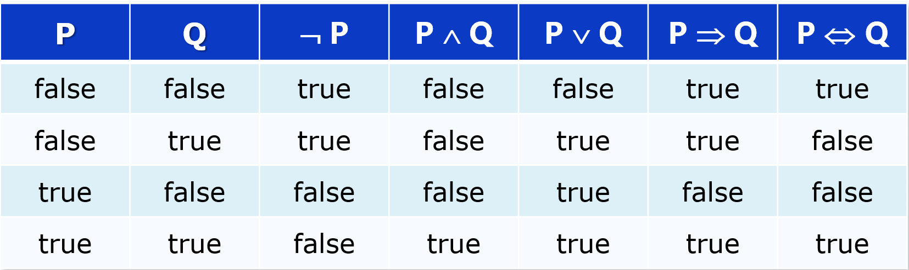
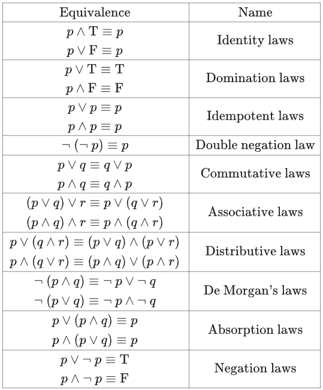
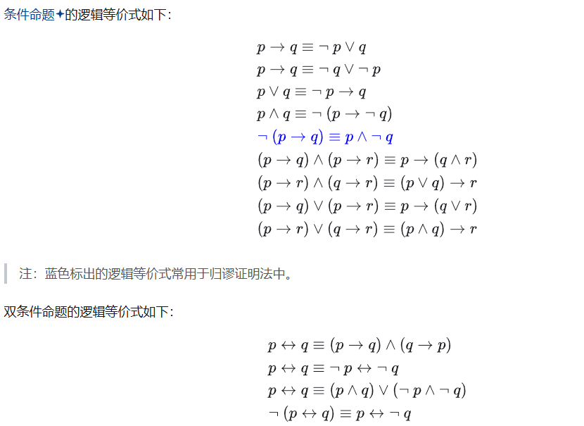

# 命题逻辑

## 1.逻辑

逻辑是陈述式语言: 利用声明的语句推断问题空间中其它语句所代表的事件的真假，声明的语句代表问题空间中能够成立的事实

语法定义语句的形式，合法语句的规范

语义定义语句的意义，及语句在可能世界中的真值

模型：当对语句 s 中所有变量的赋值使得语句 s 的真值为 true 时，这个赋值被称为语句 s 的模型

知识库是语句的集合，记为 KB

m 是知识库的模型 当且仅当 m 是知识库中所有语句的模型

M(a) 表示语句 a 的模型的集合，M(KB)表示 KB 的模型的集合

一个知识库/语句是可满足的 当且仅当 它有至少一个模型

一个知识库/语句是永假的 当且仅当 它没有模型

一个知识库/语句是永真的 当且仅当 它对可能世界都为真

知识库 KB 逻辑蕴含语句 a 当且仅当 当 KB 为真时，a 总是为真: KB ╞ a

KB ╞ a 当且仅当 M(KB) ⊆ M(a)：

* M(a) 是 a 的模型的集合
* M(KB)是 KB 的模型的集合

## 2.命题逻辑

* 若 S 是一个语句, 则 ¬ S 是一个语句（否定式)
* 若 S1 和 S2 是语句, 则 S1 ∧ S2 是语句 (合取式)
* 若 S1 和 S2 是语句, S1 ∨ S2 是语句 (析取式)
* 若 S1 和 S2 是语句, S1 ⇒ S2 是语句 (蕴含式)
* 若 S1 和 S2 是语句, S1 ⇔ S2 是语句 (双向蕴含式）

逻辑连词真值表：

逻辑连接词的运算优先级:

* ¬ 的优先级最高，其它没有定论
* 为了避免歧义，括号不能少

逻辑等价：

演绎定理：对任意语句 α 和 β，α ╞ β 当且仅当语句 α ⇒ β 永真

推论：对任意语句 α 和 β，α ╞ β 当且仅当语句（α ∧ ¬β）永假

合取范式：形如(¬A ∨ B) ∧ (¬B ∨ C )  

## 3.一阶逻辑

一阶逻辑假设知识可以用对象和对象之间的关系描述

* 常量（个体常元）：a，b，2
* 变量（个体变元）：x，y
* 函词：返回一个对象
* 谓词：返回 true/false
* 连接词：¬，∨，∧，⇔，⇒
* 量词：∀，∃
* 嵌套量词：一个量词出现在另一个量词的作用域内
  * ∀x ∀y 等同于 ∀y ∀x
  * ∃x ∃y 等同于 ∃y ∃x 
  * ∃x ∀y 不等同于 ∀y ∃x

一阶逻辑的表示：

* **当变量用 ∀ 修饰时, 用 ⇒ 作为连接词**
* **当变量用 ∃ 修饰时，用 ∧ 作为连接词**

一阶逻辑语句的实例化：

* 全称量词实例化规则：用任意可能基项代替变量
* 存在量词实例化规则：用一个未出现在知识库中其它位置的常元或函数符号代替变量