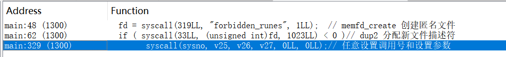
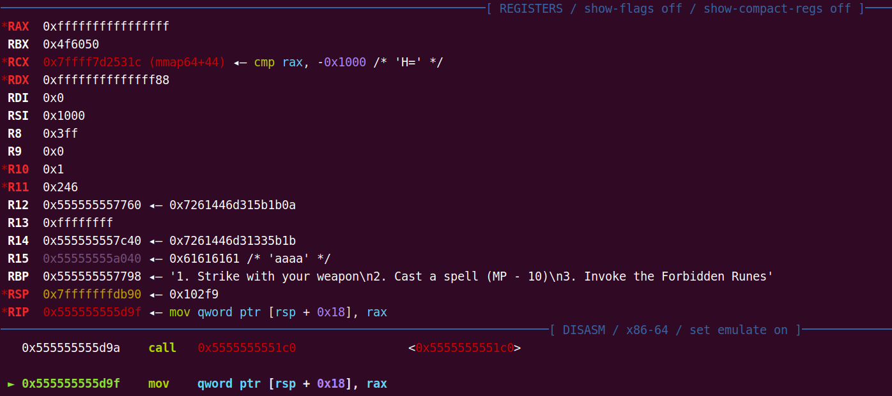
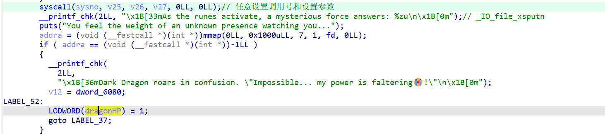
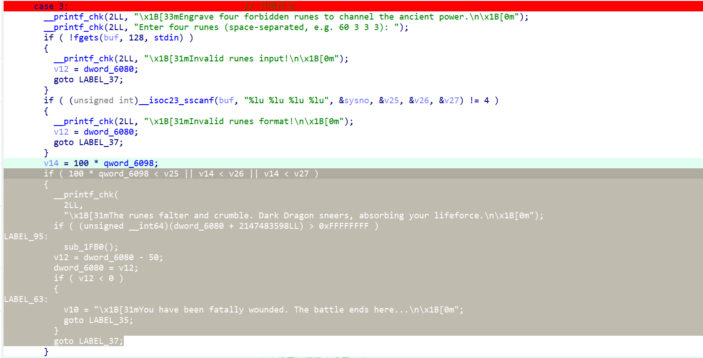
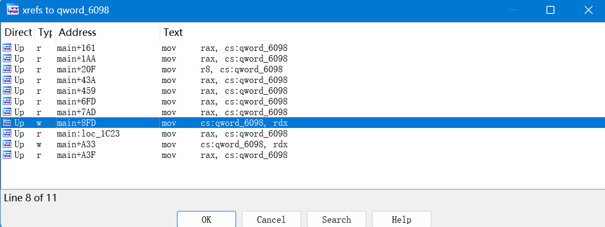
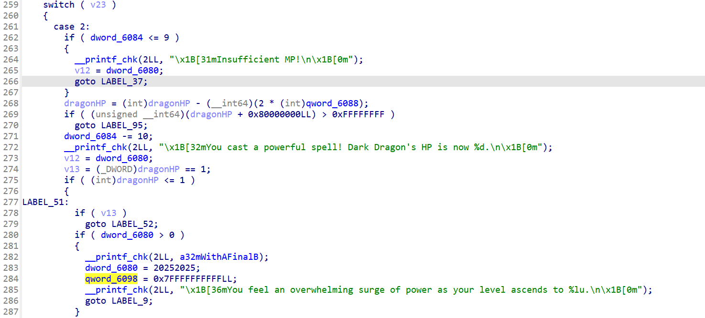
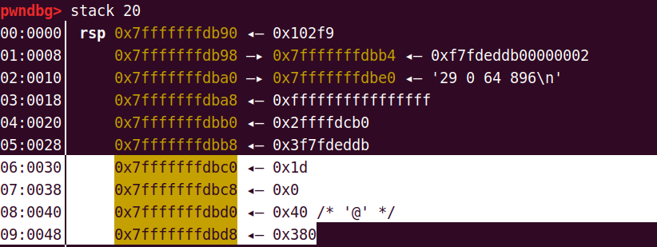
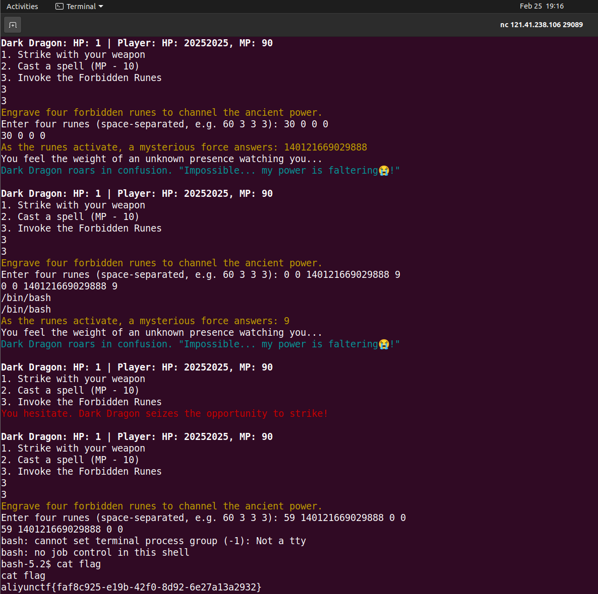

# 1.beebee

Try my beebee challenge.


# 2.broken_simulator

Have you ever PWNED a real-world project? Write your mips assembly to get /flag. Please have a look at `README` in the attachment first.


# 3.broken_compiler

Before working on the real-world challenge, let's warm up first. Write your C program to read /flag. Please have a look at `README` in the attachment first.


# 4.trust_storage

听说ATF是安全世界，有人在BL31里实现了一个"安全存储"功能，但他真的安全吗


# 5.Alimem

A module full of bugs


# 6.runes

> Show me your runes.
>
> hint：
>
> - No intended vulnerability in the bzImage/kernel, please exploit the userspace chal binary.
>   hint
> - As the challenge's name implies, you need to focus on the `syscall` aka rune in this challenge. Find a way to **weaken the dark dragon's power** once your character becomes strong enough.
>   hint
> - All syscall numbers（系统调用号） used in the intended solution are under 200 and relatively well used.

从 Linux 内核 4.2 开始，系统调用表从 `arch/x86/syscalls/syscall_64.tbl` 移动到了 `arch/x86/entry/syscalls/syscall_64.tbl`

`sys_call_table`：定义在 `arch/x86/kernel/syscall_64.c` 中，是一个函数指针数组，存储了所有系统调用的实现

一个方便查看所有系统架构的系统调用表：https://chromium.googlesource.com/chromiumos/docs/+/master/constants/syscalls.md


## 6.1 思路

结合官方wp和hint，那么这题就是要求我们利用系统调用去解决，但难点在于题目的预期解使用的系统调用比较少见，同时还需要对shm这一系列的内存共享函数有一定的了解

其实题目给的游戏玩几遍就可以大概知道其逻辑了，但是容易误导解题者朝着杀怪升级屠龙的方向走，其真正的思路在于召唤禁忌符文使用prctl，禁用mmap，让恶龙的HP变成1，然后我们还需要使用一次法术，让qword_6098的值变得很大，这样才方便我们后面输入的参数是大数字，再进程共享并附加到地址空间，同时shmat返回地址空间地址，我们再将/bin/bash（这里只有bash可用，其他的都是符号链接到busybox）写入并作为参数执行execve


## 6.2 分析

程序的执行流：

* 输入名字
* 选择打小怪还是打恶龙
  * 小怪这边没什么
  * 恶龙选择
    * 使用武器
    * 使用法术
    * 召唤禁忌符文

系统调用的地方：




对于这一题需要掌握的系统调用：

```c
#include <linux/prctl.h>  /* Definition of PR_* constants */
#include <sys/prctl.h>

int prctl(PR_SET_MDWE, unsigned long mask, 0L, 0L, 0L);
```

```c
// /include/uapi/linux/prctl.h

/* Memory deny write / execute */
#define PR_SET_MDWE			65
# define PR_MDWE_REFUSE_EXEC_GAIN	(1UL << 0)
# define PR_MDWE_NO_INHERIT		(1UL << 1)
```

* 系统调用号：157，0x9d
* 对进程/线程设置内存的拒绝写-执行(PR_SET_MDWE)的掩码，保护位一旦被设置了，就不能改变
  * mask：
    * PR_MDWE_REFUSE_EXEC_GAIN：新的内存映射同时具有可写和可执行权限。已经映射的内存如果不可执行，则不能被修改为可执行
    * PR_MDWE_NO_INHERIT(since Linux 6.6)：防止子进程继承父进程的 MDWE 保护设置。启用此选项时，必须同时启用 PR_MDWE_REFUSE_EXEC_GAIN
  * 成功返回0，失败返回-1
* 阻止mmap调用的原理：PR_MDWE_REFUSE_EXEC_GAIN会阻止将内存映射成可执行权限，所以`addra = (void (__fastcall *)(int *))mmap(0LL, 0x1000uLL, 7, 1, fd, 0LL);`


```c
#include <sys/shm.h>
int shmget(key_t key, size_t size, int shmflg);
```

```c
// /include/uapi/linux/ipc.h

#define IPC_PRIVATE ((__kernel_key_t) 0)  

/* resource get request flags */
#define IPC_CREAT  00001000   /* create if key is nonexistent */
#define IPC_EXCL   00002000   /* fail if key exists */
#define IPC_NOWAIT 00004000   /* return error on wait */
```

* 系统调用号：29，0x1d
* 用于创建/共享内存段（也是进程之间的通信）
  * key：标识共享内存段
    * 如果是父子关系的进程间通信的话，这个标识符用IPC_PRIVATE来代替。如果两个进程没有任何关系，所以就用ftok()算出来一个标识符（或者自己定义一个）使用
  * size：共享内存段大小，如果获取一个已存在的贡献内存段，size参数值会被忽略
  * shmflg：指定共享内存段的创建标志和权限
    * IPC_CREAT：如果共享内存段不存在，则创建一个新的共享内存段
    * IPC_EXCL：与 `IPC_CREAT` 一起使用，确保共享内存段不存在时才创建
    * 然后将“模式” 和“权限标识”进行“或”运算，做为第三个参数。如：IPC_CREAT | IPC_EXCL | 0640 
* 成功返回一个非负的共享内存标识符（shm_id），用于后续操作（如 shmat 或 shmctl），失败返回-1


```c
#include <sys/shm.h>
void *shmat(int shmid, const void *shmaddr, int shmflg);
```

* 系统调用号：30，0x1e
* 将与shm_id指定的共享内存标识符关联的共享内存段附加到调用进程的地址空间
  * shmid:共享内存标识符id
  * shmaddr：共享内存的起始地址，如果shmaddr为0，内核会把共享内存映像到调用进程的地址空间中选定位置；如果shmaddr不为0，内核会把共享内存映像到shmaddr指定的位置。所以一般把shmaddr设为0
  * shmflg：0: 使用默认模式（读写权限）
* 成功返回一个指向共享内存段起始地址的指针，失败返回-1


那么当我们想要使用共享内存，应该有如下步骤：

- 开辟一块共享内存 shmget()
- 允许本进程使用共某块共享内存 shmat()
- 写入/读出

需要删除这块内存的时候，步骤为

- 禁止本进程使用这块共享内存 shmdt()
- 删除这块共享内存 shmctl()或者命令行下ipcrm

这题我们只需要使用这块共享内存就行了，并且系统调用号和寄存器都是我们可以任意输的（但其实还要绕过一层限制）


prctl调用后，mmap返回值为-1



巨龙血量为1



但是当我们再想要执行shmget却不行了

其实case3中是有检验判断的，这个也是调试的时候发现的，因为把断点下在syscall后，我第二次输入系统调用的时候他居然没有断住，是因为那v14判断通过走到里面去了



qword_6098默认为1，有两个可w的地方



这里比较好，用法术可以直接修改成一个大数，并且我们恶龙的HP正好是1了





后面就可以正常执行系统调用了

syscall后面有个__printf_chk，里面调用的是`_IO_file_xsputn`,但这个answer值一直没看到是怎么传的，多用几个系统调用就可以发现answer就是syscall调用后返回的rax值

那么shmat执行后answer给出的就是共享内存地址,后面getshell就行了

```c
__printf_chk(2LL, "\x1B[33mAs the runes activate, a mysterious force answers: %zu\n\x1B[0m");
```

exp：

```
// prctl(PR_SET_MDWE, PR_MDWE_REFUSE_EXEC_GAIN, 0, 0, 0)
157 65 1 0
// shmget(IPC_PRIVATE, SIZE, IPC_CREAT|0600);
29 0 64 896
// shmat(shmid, NULL, 0) ;
30 0 0 0
// read(0, shmem_addr, 9) /bin/bash
0 0 140121669029888 9
// execve(shmem_addr, 0, 0)
59 140121669029888 0 0
```

