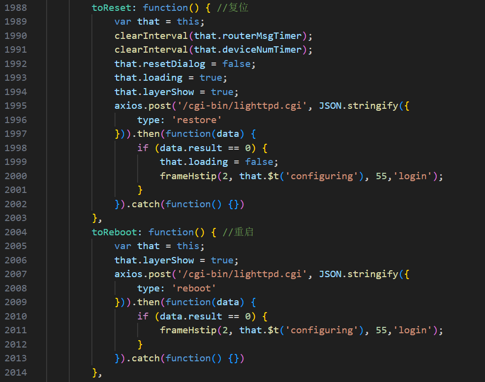
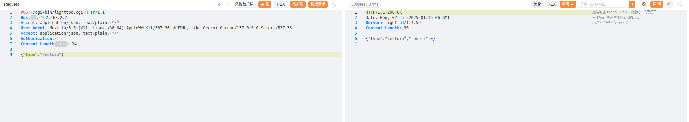
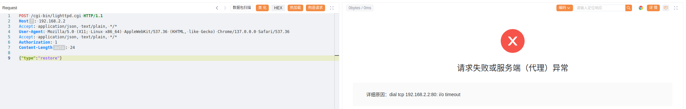

# Authentication Bypass Vulnerability for Sensitive Operations in Multiple Blink Router Models

BUG_Author: waiwai

Vendor：[Blink](https://www.b-link.net.cn/)

Product: Multiple routers using libblinkapi.so component, including BL-AX5400P V1.0.19, BL-AX1800 V1.0.19, BL-AC3600 V1.0.22, BL-WR9000 V2.4.9, BL-AC1900 V1.0.2, BL-AC2100_AZ3 V1.0.4.

Vulnerability Files: libblinkapi.so

## Description

A critical authentication bypass vulnerability exists in the router's web management interface. This flaw allows attackers to perform sensitive operations such as remote restart or factory reset through simple HTTP requests without proper authentication verification, leading to network service disruption and configuration data loss.

**Vulnerable API Endpoints**

- `POST /cgi-bin/lighttpd.cgi` - `{"type":"reboot"}` (System Reboot)
- `POST /cgi-bin/lighttpd.cgi` - `{"type":"restore"}` (Factory Settings Restore)

Vulnerable frontend code here, and correspondingly, the backend CGI performs no verification

## POC

The router service is offline and is waiting for a restart

## Impact

Immediate Consequences:

- **Network Service Outage:** System reboot results in complete network connectivity loss
- **Configuration Data Loss:** Factory restoration eliminates all personalized settings
- **Credential Loss:** WiFi passwords, port forwarding configurations permanently deleted
- **Access Control Compromise:** Administrative credentials reverted to factory defaults

Secondary Effects:

- **Operational Disruption:** Network-reliant business operations experience downtime
- **Security Exposure:** Post-reset default settings may introduce security weaknesses
- **Recovery Overhead:** Complete network reconfiguration required"