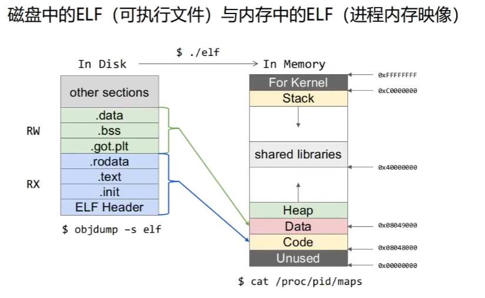

源代码：存于磁盘（节视图）

可执行文件：经源代码编译后，存于磁盘，拷贝到内存，变成了一个进程对应的虚拟内存区域（进程内存映像）vm

vm：段视图用于进程的内存的rwx权限的划分

物理内存经OS转化给程序员看的虚拟内存VM（32位系统，寻你内存大小4GB），每个进程独享一份虚拟内存，所有进程的虚拟内存的kernel是共享的

amd64寄存器结构

rax：8bytes

eax：4

ax：2

ah：1高

al：1低

部分寄存器

RIP：存放当前执行的下一条执行指令的偏移地址

RSP：存放当前栈帧的栈顶偏移地址

RBP：存放当前栈帧的栈底偏移地址

RAX：通用寄存器。存放函数返回值