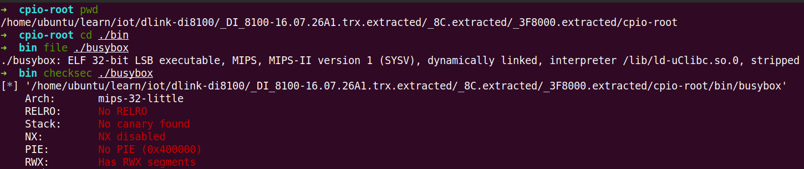
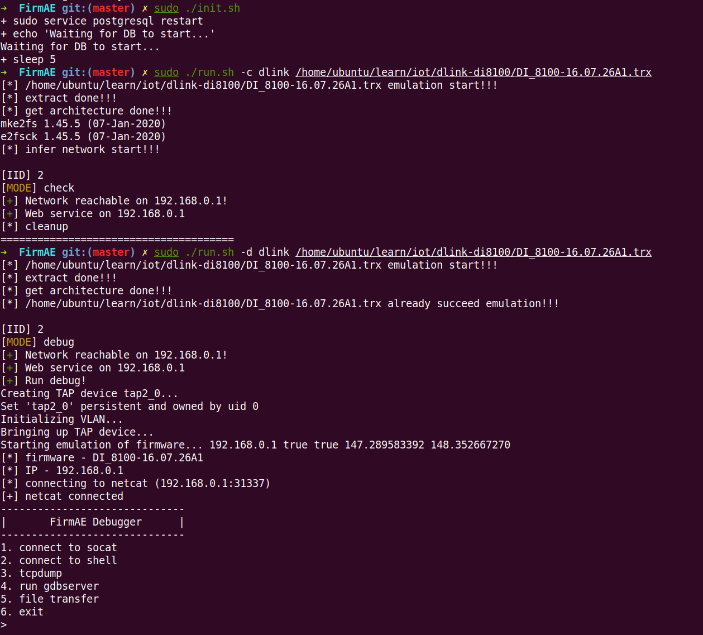
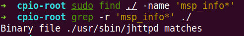
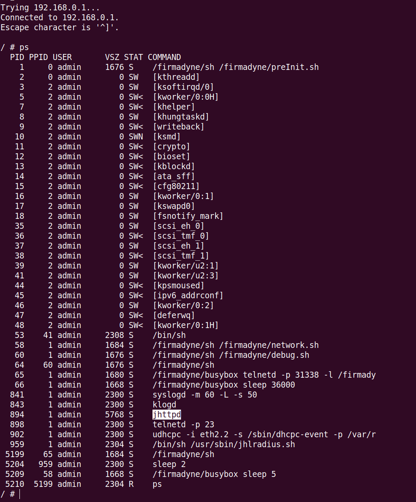

# CVE-2024-7436 命令注入

## 1.漏洞描述

在 D-Link DI-8100 16.07 中发现了一个被归类为严重的漏洞。影响 msp_info.htm 文件中的 msp_info_htm 功能。对参数 cmd 的操作会导致命令注入。攻击可能是远程发起的。这个漏洞已经向公众披露，可能会被利用。标识符 VDB-273521 被分配给此漏洞

## 2.固件分析

下载网址：https://www.dlink.com.cn/techsupport/ProductInfo.aspx?m = DI-8100

下载 A1 版本固件，后缀为 trx

固件未加密，binwalk 可直接解压

固件使用的是 mips32 位小端

firmAE 可直接进行模拟：

## 3.漏洞分析

漏洞描述是影响 msp_info.htm 文件中的 msp_info_htm 功能，找这个文件没看见，但是可以在 jhttpd 文件中匹配到字符，jhttpd 是一个web服务，可以在仿真系统的进程当中看到

