# CVE-2023-34644 远程命令执行

## 1.漏洞描述

睿捷网络家庭路由器和中继器 RG-EW 系列 EW_3.0(1)B11P204，RG-NBS 和 RG-S1930 系列交换机 SWITCH_3.0(1)B11P218，商业 VPN 路由器 RG-EG 系列 EG_3.0(1)B11P216，无线接入点 EAP 和 RAP 系列 AP_3.0(1)B11P218，以及无线控制器 NBC 系列 AC_3.0(1)B11P86 中的漏洞，允许未经授权的远程攻击者通过向/cgi-bin/luci/api/auth 发送特制的 POST 请求来获取最高权限。


## 2.mips 分析环境搭建

要求工具：

RetDec IDA plugin：https://github.com/avast/retdec-idaplugin

Retdec：https://github.com/avast/retdec

cmake

ida8.3

照着很多教程搭了很多遍还是没有弄好，遂放弃，后来发现我的 ida9.0 可以直接反汇编 mips，太好了。（jeb 也可以反汇编 mips 的，但是他那个界面我用着不太习惯）

另外就是使用 buildroot 安装交叉编译环境

## 3.固件解密

由于没有找到 EW_3.0(1)B11P219_EW1200I_10200109_install_encypto.bin 老固件，所以我们用新版本 EW_3.0(1)B11P261_EW1300G_11222807_install_encypto.bin 的固件尝试一下

老版本的固件作者已经提供了解密后的，新版本的解密思路和老版本差不过

直接使用 binwalk 是识别不出来的：

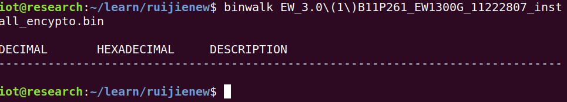

010editor 打开可以发现文件尾部是有大量重复的 0x80 字节的

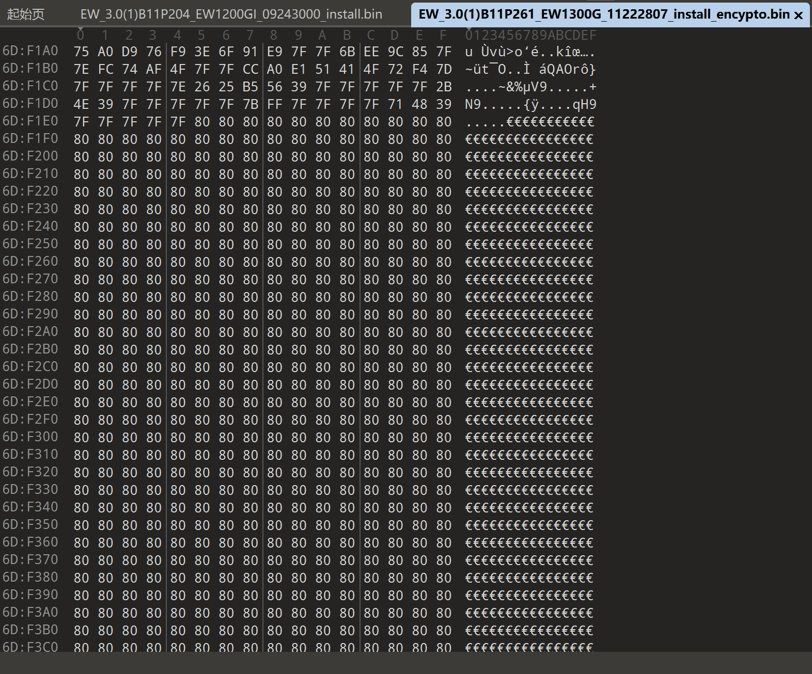

根据 winmt 师傅的说法，文件末尾会填充大量的 `\xff` 或者 `\x00` 字节码，这里有大量的重复字节码 `0x80` ，猜测可能是单字节异或 `key` 得到的。尝试拿 `0xff` 与 `0x80` 进行异或，得到疑似 `key` 值 `0x7f` 

python 编写一个简单的解密脚本：

```python
def xor_firmware(input_file, output_file):
    try:
        with open(input_file, 'rb') as f_in, open(output_file, 'wb') as f_out:
            while byte := f_in.read(1):
                f_out.write(bytes([byte[0] ^ 0x7f]))
        print(f"处理完成，结果已保存到 {output_file}")
    except IOError as e:
        print(f"文件操作失败: {e}")

if __name__ == "__main__":
    input_file = "EW_3.0(1)B11P261_EW1300G_11222807_install_encypto.bin" 
    output_file = "output_firmware.bin" 
    xor_firmware(input_file, output_file)
```

binwalk 再次识别可以识别出来

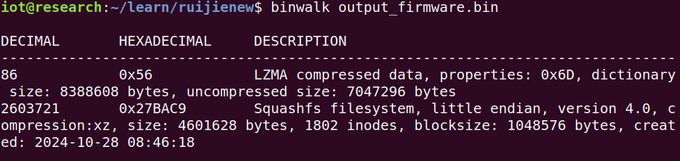

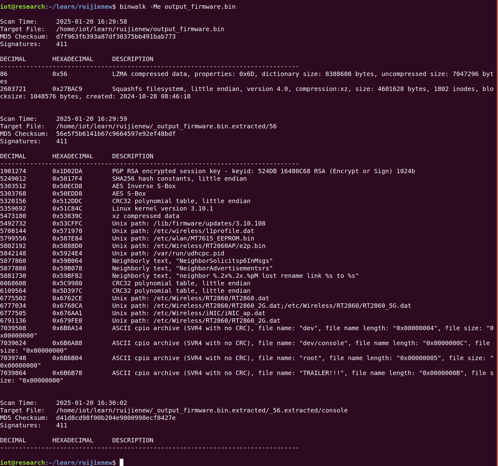

识别出来的文件系统：

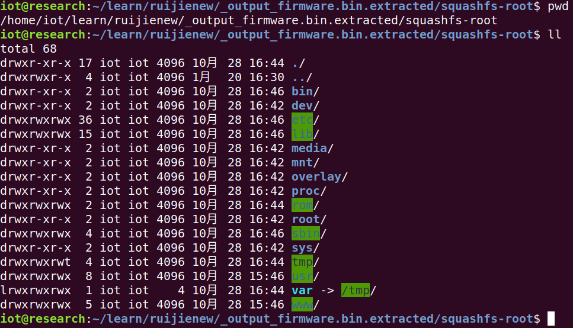

拿到文件系统后，可以去寻找负责加解密的程序

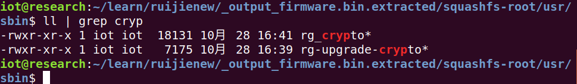

对 rg-upgrade-crypto 二进制文件进行分析:

在 main 函数里面，主要是对运行文件时输入的参数进行一个处理，真正处理的函数在 sub_4010c0 里面

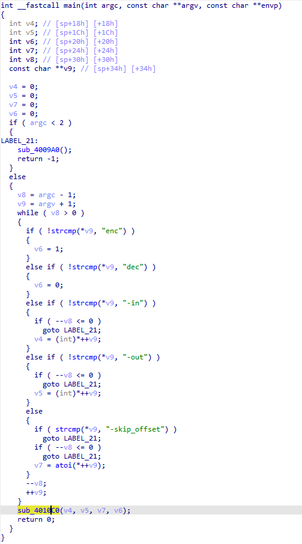

分析发现，加解密用的是一套流程：

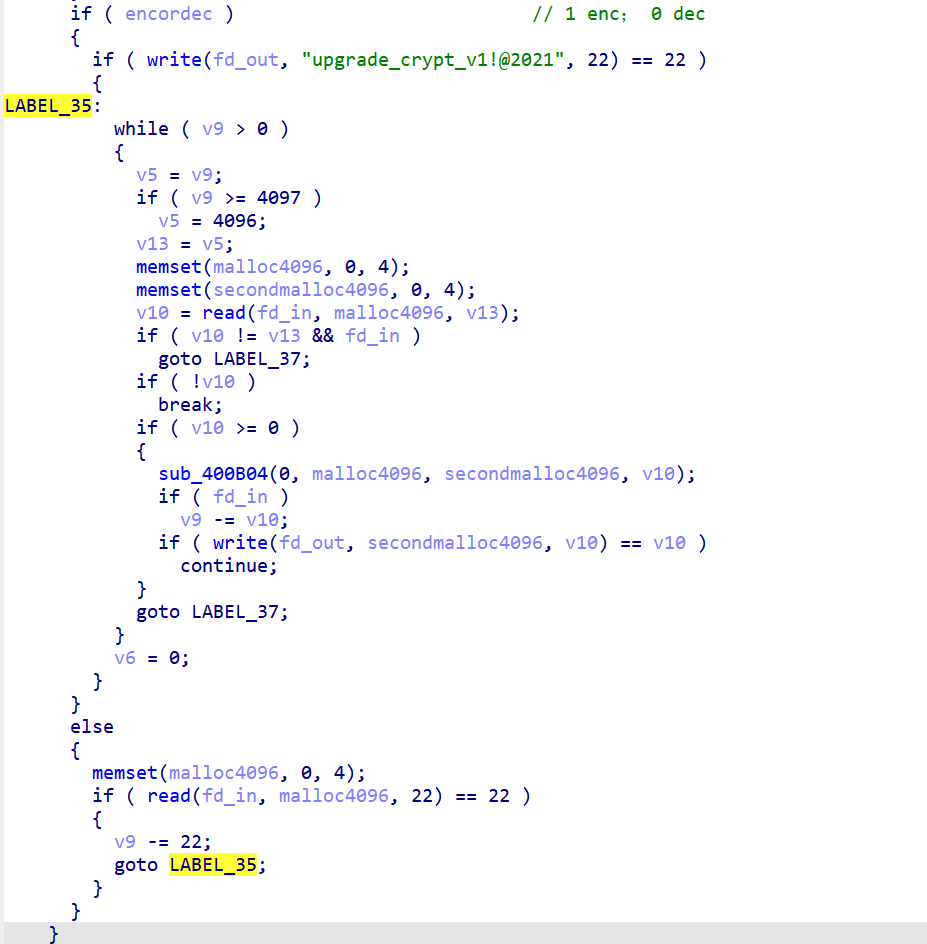

主要加密函数调用的是 sub_400B04()

因为 IDA 里面定义了很多的宏，所以如果对这些自定义的宏不太了解的化看起来还是挺吃力的，Ghidra 对 Mips 指令的支持更好，而且不用安装相关插件就可以反汇编，而 ida 要高版本才行，安装 retdec 插件我暂时也还没安装成功

左边是 IDA 的反汇编，右边是 Ghidra 的反汇编，这样我们就可以分析出宏 BYTEn(x)的含义为从 x 的位置取第 n 个字节

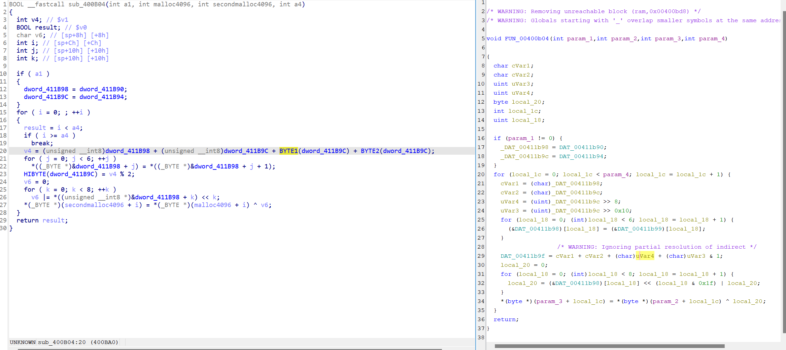

对照着反汇编，参考 winmt 师傅写的解密脚本：

主要流程：分别打开和创建加解密文件，分配加解密的缓冲区，首先读取并丢弃掉前 22 字节头部，对剩余内容进行逐轮次解密，解密的过程前几轮密钥是在出事后，然后密钥就会一直保持不变直到下一轮迭代的解密

```C
#include <stdio.h>
#include <fcntl.h>
#include <stdlib.h>
#include <unistd.h>
#include <string.h>
#include <malloc.h>
#include <sys/stat.h>

typedef unsigned char uint8_t;
#define BYTE(x, n) (*((uint8_t *)&(x)+n))

void error_msg(char *msg)
{
	puts(msg);
	exit(-1);
}

int num1 = 1, num2 = 0x10001;

void decrypt(uint8_t *enc_buf, uint8_t *dec_buf, int length)
{
	for (int i = 0; i < length; i++)
	{
		int sum = (uint8_t)num1 + (uint8_t)num2 + BYTE(num2, 1) + BYTE(num2, 2);
		BYTE(num2, sizeof(num2)/sizeof(uint8_t)-1) = sum % 2;
		
		for (int j = 0; j < 6; j++)
			*((uint8_t *)&num1 + j) = *((uint8_t *)&num1 + j + 1);
		
		uint8_t key = 0;
		for (int k = 0; k < 8; k++)
			key |= *((uint8_t *)&num1 + k) << k;
		*(uint8_t *)(dec_buf + i) = *(uint8_t *)(enc_buf + i) ^ key;
	}
}

int main(int argc, char **argv, const char **envp)
{
	if (argc < 2) error_msg("Usage: ./rg-decrypt [encrypted_firmware_path]");
	
	char *enc_path = strdup(argv[1]);
	char *dec_path = malloc(strlen(argv[1]) + 0x10);
	strcpy(dec_path, argv[1]);
	strcat(dec_path, ".decrypted");
	
	struct stat stat_buf;
	int stat_fd = stat(enc_path, &stat_buf);
	if (stat_fd < 0) error_msg("The encrypted firmware does not exist !");
	int size = stat_buf.st_size;
	
	uint8_t *enc_buf = (uint8_t *)malloc(0x1000);
	uint8_t *dec_buf = (uint8_t *)malloc(0x1000);
	
	int enc_fd = open(enc_path, O_RDONLY);
	if (enc_fd < 0) error_msg("Error to open the encrypted firmware !");
	
	int dec_fd = open(dec_path, O_WRONLY | O_CREAT, S_IREAD | S_IWRITE | S_IRGRP);
	if (dec_fd < 0) error_msg("Error to create the decrypted firmware !");
	
	if (read(enc_fd, enc_buf, 22) != 22) error_msg("Error to read from the encrypted firmware !");
	size -= 22;
	
	while(size > 0)
	{
		int len = size;
		if (size > 0x1000) len = 0x1000;
		
		memset(enc_buf, 0, sizeof(enc_buf));
		memset(dec_buf, 0, sizeof(dec_buf));
		
		if (read(enc_fd, enc_buf, len) != len) error_msg("Error to read from the encrypted firmware !");
		decrypt(enc_buf, dec_buf, len);
		if (write(dec_fd, dec_buf, len) != len) error_msg("Error to write into the decrypted firmware !");
		size -= len;
	}
	
	free(enc_buf);
	free(dec_buf);
	close(enc_fd);
	close(dec_fd);
	return 0;
}

```

编译：

```shell
gcc rg-decryt.c  -o rg-decryt -m32 -static -g
```

运行：

```shell
./rg-decryt 'EW_3.0(1)B11P261_EW1300G_11222807_install_encypto.bin' 
```

在每一轮的加密过程中，只有每一轮前几次加密的密钥不是 127，后面的密钥都是 127

可以对比一下前后不同解密算法，用 binwalk 分析后的结果：

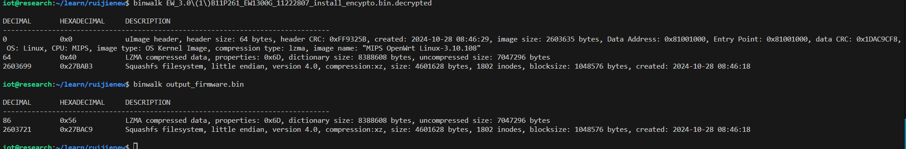

## 4.解密后的固件

使用 binwalk 分析一下：

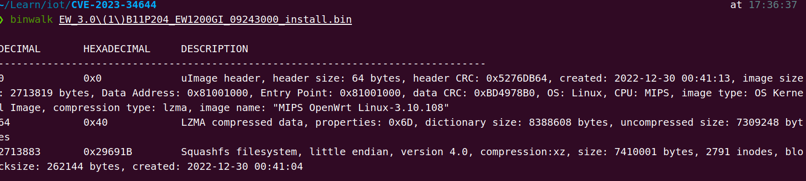

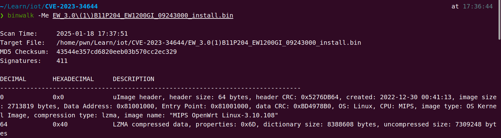

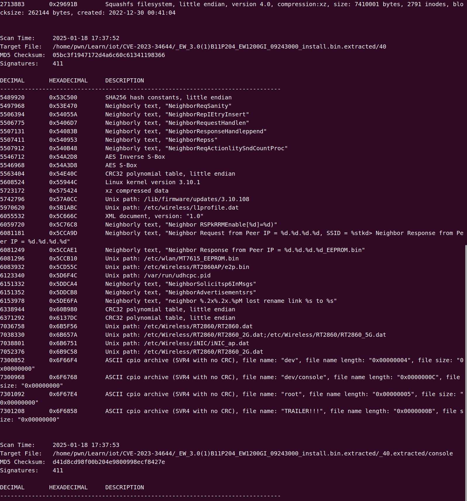

识别出来的文件系统：

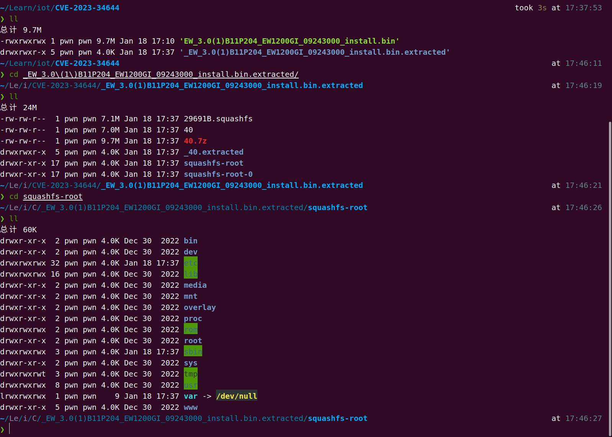


## 5.luci工作原理

LuCI 作为“FFLuCI”诞生于 2008 年 3 月份，目的是为 OpenWrt 固件从 Whiterussian 到 Kamikaze 实现快速配置接口。Lua 是一个小巧的脚本语言，很容易嵌入其它语言。轻量级 LUA 语言的官方版本只包括一个精简的核心和最基本的库。这使得 LUA 体积小、启动速度快，从而适合嵌入在别的程序里。UCI 是 OpenWrt 中为实现所有系统配置的一个统一接口，英文名 Unified Configuration Interface，即统一配置接口。LuCI, 即是这两个项目的合体，可以实现路由的网页配置界面。

最初开发这个项目的原因是没有一个应用于嵌入式的免费，干净，可扩展以及维护简单的网页用户界面接口。大部分相似的配置接口太依赖于大量的 Shell 脚本语言的应用，但是 LuCi 使用的是 Lua 编程语言，并将接口分为逻辑部分，如模板和视图。LuCI 使用的是面向对象的库和模板，确保了高效的执行，轻量的安装体积，更快的执行速度以及最重要的一个特性————更好的可维护性。

Lua 工作和配置文件在/usr/lib/lua 目录下

Luci 工作和配置文件在/usr/lib/lua/luci 目录下

luci 目录常用到的是：controller、view、以及 Model 目录，它们构成一个 MVC 管理机制

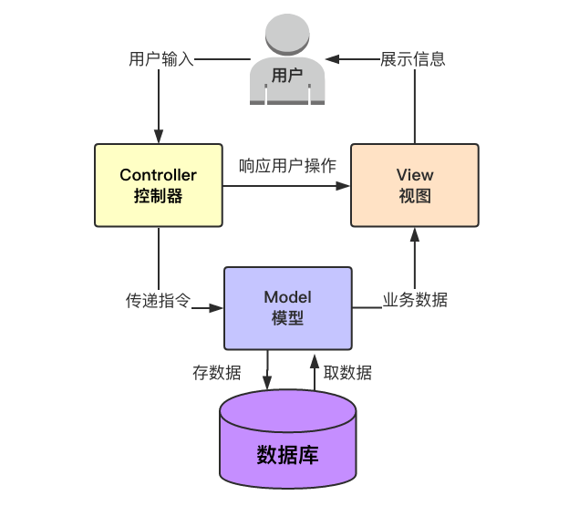

在 `www/index.html` 下会指定 cgi 程序的启动脚本

```
<a href="/cgi-bin/luci/">
```

而在 luci 中，会指定加载的模块，调度器索引缓存路径，启动的 run 函数

```
#!/usr/bin/lua
require "luci.cacheloader"
require "luci.sgi.cgi"
luci.dispatcher.indexcache = "/tmp/luci-indexcache"
luci.sgi.cgi.run()
```

在 `usr/lib/lua/luci/sgi/cgi.lua` 中，创建一个 HTTP 请求对象，创建一个协程来处理 HTTP 请求，并且循环处理协程的状态，直到协程结束

```lua
function run()
	local r = luci.http.Request(
		luci.sys.getenv(),
		limitsource(io.stdin, tonumber(luci.sys.getenv("CONTENT_LENGTH"))),
		ltn12.sink.file(io.stderr)
	)
	
	local x = coroutine.create(luci.dispatcher.httpdispatch)
	local hcache = ""
	local active = true
	
	while coroutine.status(x) ~= "dead" do
		local res, id, data1, data2 = coroutine.resume(x, r)

		if not res then
			print("Status: 500 Internal Server Error")
			print("Content-Type: text/plain\n")
			print(id)
			break;
		end

		if active then
			if id == 1 then
				io.write("Status: " .. tostring(data1) .. " " .. data2 .. "\r\n")
			elseif id == 2 then
				hcache = hcache .. data1 .. ": " .. data2 .. "\r\n"
			elseif id == 3 then
				io.write(hcache)
				io.write("\r\n")
			elseif id == 4 then
				io.write(tostring(data1 or ""))
			elseif id == 5 then
				io.flush()
				io.close()
				active = false
			elseif id == 6 then
				data1:copyz(nixio.stdout, data2)
				data1:close()
			end
		end
	end
end
```

上述 run()函数中，创建了一个协同程序，调用 httpdispatch()函数，而这个函数位于 dispatcher.lua 中。通过分析可以发现，luci 真正的主体部分都在 dispatcher.lua 脚本里

dispatcher.lua 是 LuCI 框架中的调度器模块，负责处理 HTTP 请求并将其分派到相应的控制器:

* 主要函数：
  * `entry`：创建一个新的调度节点
  * `httpdispatch`：处理 HTTP 请求。它解析请求路径，并将请求分派到相应的处理函数
  * `dispatch`：用于将请求分派到相应的处理函数。它解析请求路径，并根据路径找到相应的节点，然后调用节点的目标函数
* 辅助函数：
  * `build_url`：构建相对 URL。
  * `node_visible`：检查节点是否可见。
  * `node_childs`：返回节点的子节点。
  * `error404` 和 `error500`：发送 404 和 500 错误响应。
  * `createindex` 和 `createtree`：创建调度树和索引。

## 6.漏洞分析

固件的 cgi 部分是用 lua 语言写的，挖掘未授权漏洞，那么我们就需要找到与鉴权相关的 API 接口

在 `/usr/lib/` 路径下存在一个 `lua` 目录，其中存放了很多 `lua` 文件，主要是对前端传入的数据进行处理让弄胡传递给 cgi

搜索 sysauth，可以找到在 api.lua 文件中 sysauth = false

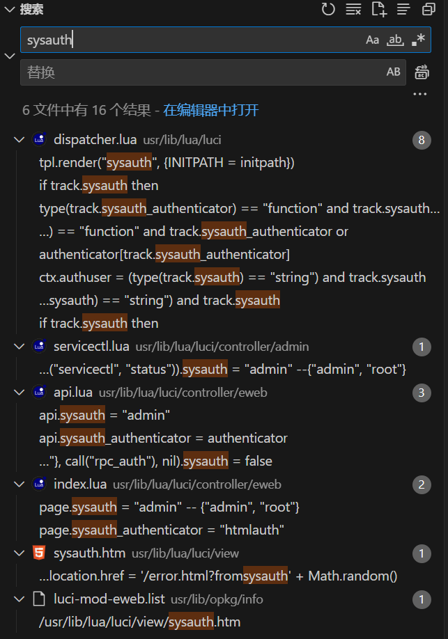

在 `/usr/lib/lua/luci/controller/eweb/api.lua` 文件中，配置了

```lua
 entry({"api", "auth"}, call("rpc_auth"), nil).sysauth = false
```

而 entry 函数用于创建一个新的调度节点，定义在 `usr/lib/lua/luci/dispatcher.lua`

```lua
--- Create a new dispatching node and define common parameters.
-- @param	path	Virtual path
-- @param	target	Target function to call when dispatched.
-- @param	title	Destination node title
-- @param	order	Destination node order value (optional)
-- @return			Dispatching tree node
function entry(path, target, title, order)
	local c = node(unpack(path))

	c.target = target
	c.title = title
	c.order = order
	c.module = getfenv(2)._NAME

	return c
end
```

也就意味着当用户访问 `/api/auth` 路径的时候，将会调用 `rpc_auth` 函数 ，并且这里的 `sysauth` 是 false，表示无需系统认证就可以访问

跟踪 `rpc_auth` 函数：

首先引入了一些模块，然后判断 HTTP_CONTENT_LENGTH 的长度是否大于 1000 字节，如果不大于的化就会返回 json 格式，并进行 handle 处理

```lua
-- 认证模块
function rpc_auth()
    local jsonrpc = require "luci.utils.jsonrpc"
    local http = require "luci.http"
    local ltn12 = require "luci.ltn12"
    local _tbl = require "luci.modules.noauth"
    if tonumber(http.getenv("HTTP_CONTENT_LENGTH") or 0) > 1000 then
        http.prepare_content("text/plain")
        -- http.write({code = "1", err = "too long data"})
        return "too long data"
    end
    http.prepare_content("application/json")
    ltn12.pump.all(jsonrpc.handle(_tbl, http.source()), http.write)
end
```

`jsonrpc` 的 `handle` 函数：

这里主要关注一下 `resolve(tbl, json.method)`

```lua
function handle(tbl, rawsource, ...)
    local decoder = luci.json.Decoder()
    local stat, err = luci.ltn12.pump.all(rawsource, decoder:sink())
    local json = decoder:get()
    local response
    local success = false

    if stat then
        if type(json.method) == "string" then
            local method = resolve(tbl, json.method)
            if method then
                response = reply(json.jsonrpc, json.id, proxy(method, json.params or {}))
            else
                response = reply(json.jsonrpc, json.id, nil, {code = -32601, message = "Method not found."})
            end
        else
            response = reply(json.jsonrpc, json.id, nil, {code = -32600, message = "Invalid request."})
        end
    else
        response = reply("2.0", nil, nil, {code = -32700, message = "Parse error.", err = err})
    end

    return luci.json.Encoder(response, ...):source()
end
```

回溯重新定位一下 `tbl` ,`local _tbl = require "luci.modules.noauth"`相当于一个table，里面定义了四个函数：login、singlelogin、merge、checkNet
