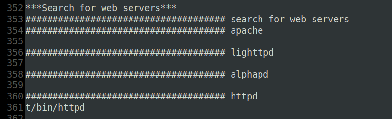
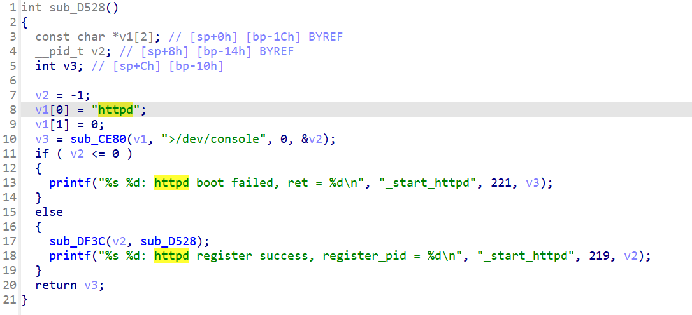
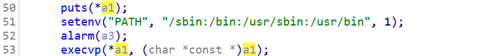

# CVE-2024-2813 缓冲区溢出

## 1.漏洞描述

Tenda AC15 15.03.20_multi 中发现一个漏洞。该漏洞已被声明为严重漏洞。此漏洞影响文件 /goform/fast_setting_wifi_set 的 form_fast_setting_wifi_set 函数。对参数 ssid 的操纵会导致基于堆栈的缓冲区溢出。攻击可以远程发起。


firmwalker 审一下，可以看到是 httpd 服务，并且是 arm 小端 32 位



etc_ro/init.d/rcS 启动项最后：

* cfmd 进程暂时不清楚
* hotplug 即热插拔，写入空字符串也就是禁用
* udevd 是一个设备管理守护进程，负责处理设备的添加和移除事件
* logserver 用于处理日志记录
* moniter 看名字应该自定义的监控进程
* telnetd 是一个 telnet 服务守护进程，用于提供远程登录功能

```shell
cfmd &
echo '' > /proc/sys/kernel/hotplug
udevd &
logserver &

tendaupload &
if [ -e /etc/nginx/conf/nginx_init.sh ]; then
	sh /etc/nginx/conf/nginx_init.sh
fi

moniter &
telnetd &
```

分析一下cfmd：

定位到httpd处理的一个函数：



传入sub_CE80，并执行



