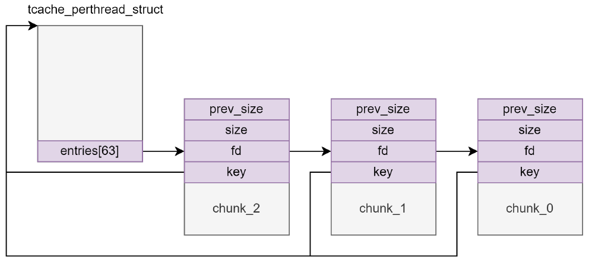

# tcache key 绕过

## 1.tcache key 基本概念

glibc2.29 版本起 tcache 新增了一个 key 字段，该字段位于 chunk 的 bk 字段，值为 tcache 结构体的地址，若 free() 检测到 chunk-> bk == tcache 则会遍历 tcache 查找对应链表中是否有该 chunk

最新版本的一些老 glibc （如新版 2.27 等）也引入了该防护机制

由于 tcache 用的是 fd 字段所在地址，因此可以通过泄露 tcache key 来泄露堆地址



```c
typedef struct tcache_entry
{
  struct tcache_entry *next;
  /* This field exists to detect double frees.  */
  struct tcache_perthread_struct *key;
} tcache_entry;
```

```c
// glibc-2.31
static __always_inline void
tcache_put (mchunkptr chunk, size_t tc_idx)
{
  tcache_entry *e = (tcache_entry *) chunk2mem (chunk);

  /* Mark this chunk as "in the tcache" so the test in _int_free will
     detect a double free.  */
  e->key = tcache;

  e->next = tcache->entries[tc_idx];
  tcache->entries[tc_idx] = e;
  ++(tcache->counts[tc_idx]);
}

/* Caller must ensure that we know tc_idx is valid and there's
   available chunks to remove.  */
static __always_inline void *
tcache_get (size_t tc_idx)
{
  tcache_entry *e = tcache->entries[tc_idx];
  tcache->entries[tc_idx] = e->next;
  --(tcache->counts[tc_idx]);
  e->key = NULL;
  return (void *) e;
}

// _int_free 中对 key 的检查
#if USE_TCACHE
  {
    size_t tc_idx = csize2tidx (size);
    if (tcache != NULL && tc_idx < mp_.tcache_bins)
      {
	/* Check to see if it's already in the tcache.  */
	tcache_entry *e = (tcache_entry *) chunk2mem (p);

	/* This test succeeds on double free.  However, we don't 100%
	   trust it (it also matches random payload data at a 1 in
	   2^<size_t> chance), so verify it's not an unlikely
	   coincidence before aborting.  */
	if (__glibc_unlikely (e->key == tcache))
	  {
	    tcache_entry *tmp;
	    LIBC_PROBE (memory_tcache_double_free, 2, e, tc_idx);
	    for (tmp = tcache->entries[tc_idx];
		 tmp;
		 tmp = tmp->next)
	      if (tmp == e)
		malloc_printerr ("free(): double free detected in tcache 2");
	    /* If we get here, it was a coincidence.  We've wasted a
	       few cycles, but don't abort.  */
	  }

	if (tcache->counts[tc_idx] < mp_.tcache_count)
	  {
	    tcache_put (p, tc_idx);
	    return;
	  }
      }
  }
#endif
```


glibc-2.34 开始，tcache 的 key 不再是 tcache_pthread_struct 结构体地址，而是一个随机数 tcache_key ，因此不能通过 key 泄露堆地址。
