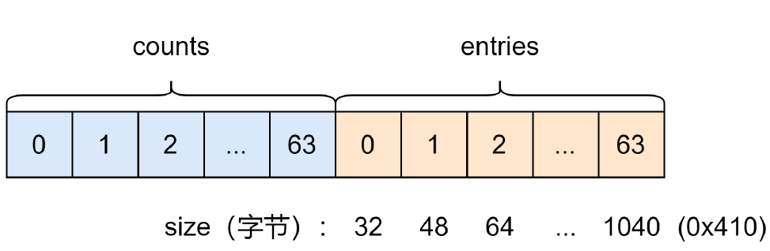

# 绕过tcache

如果想让释放的 chunk 不进入 tcache 有如下方法：

* 释放不在 tcache 大小范围的 chunk

  ```c
  add_chunk(0, 0x410)
  add_chunk(1, 0x10)
  delete_chunk(0)
  ```

  

* 释放 7 个同样大小的 chunk 进入 tcache 填满对应位置的位置

  ```c
  for i in range(7):
  	add_chunk(i, 0x68)
  add_chunk(7, 0x68)
  for i in range(7):
  	delete_chunk(i)
  delete_chunk(7)
  ```

  

