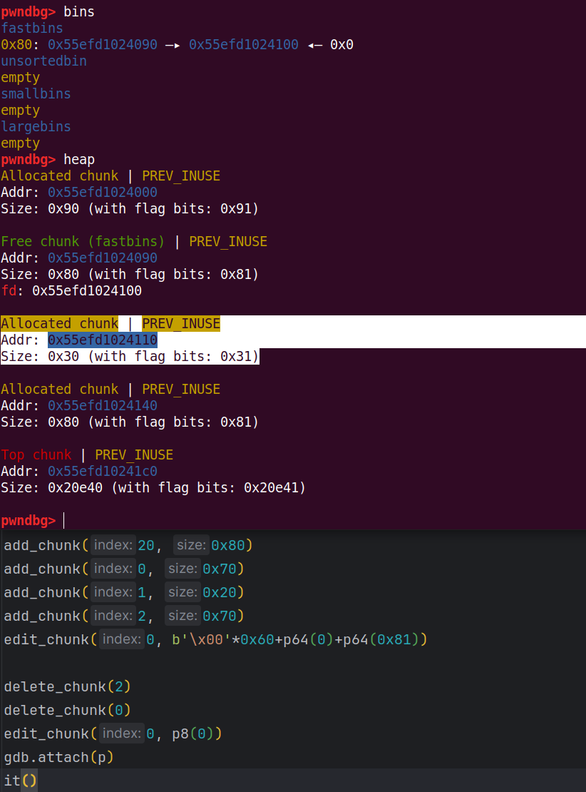
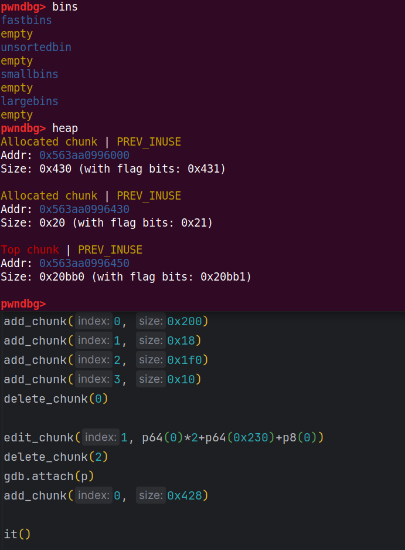
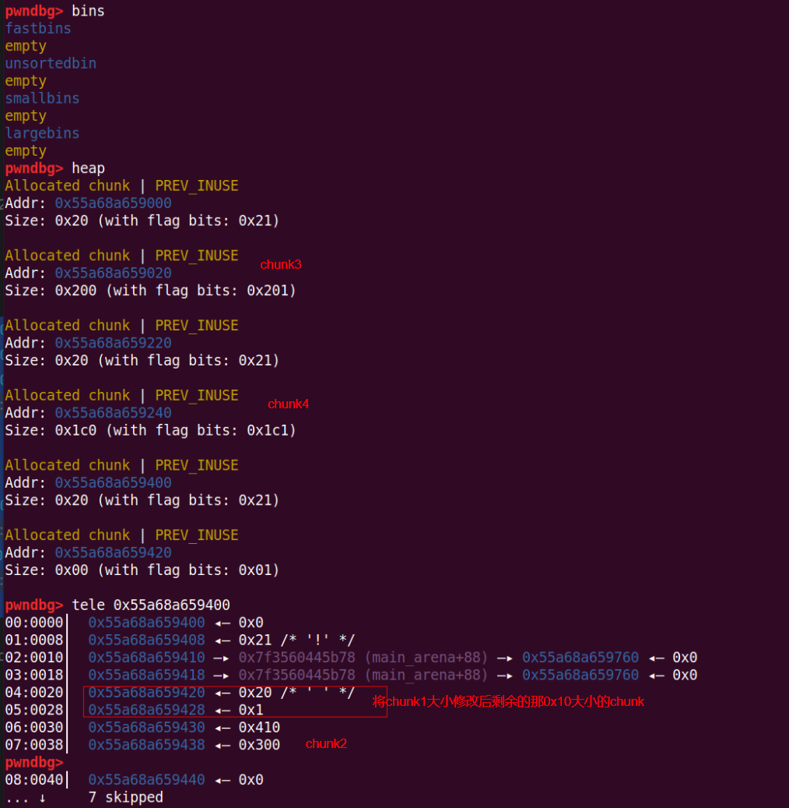

# heap overlapping

## 1.基本概念

堆块重叠指的是指让一个堆块能控制另一个堆块的头部，而不是只能控制内存区域


## 2.UAF 转 Heap Overlapping

以 fastbin attack 为例，在堆块的内存区域 **伪造 chunk 的 size** 然后利用 UAF 部分地址写将 **fd 修改** 到伪造的 chunk 头部，之后将 fake chunk 申请出来就可以造成堆块重叠





## 3.off by null 转 Heap Overlapping

off by null：只能溢出一字节并且这一字节无法控制只能写入 0

利用两个 chunk 中间的小 chunk 溢出修改 prev_size(计算前一个 chunk 则是根据 prev_size)和 prev_inuse，让 chunk2 以为可以同前一个 chunk 合并，从而释放 chunk2 进入 unsorted bin 与 chunk0 合并，后面我们将 chunk0 申请出来，并且将 chunk1 释放掉，那么我们就可以利用 heap overlap 的 chunk0 控制 chunk1 了



如果不是在输入的内容后面一个字节写 0 ，即在下一个 chunk 的 size 最低 1 字节写 0（设置恰当的 size 把 size 改小）但 **不能控制 prev_size** 时可以采用下面的构造方法：

* 一开始的构造还是同上，我们先假设还是只有 0，1，2 三个 chunk，这一次 0 的 chunk 是偏小的，1 的 chunk 是偏大的
* 释放掉 chunk1，那么 chunk2 的 prev_inuse 置为 0，利用 chunk0 的溢出能够把 chunk1 的 size 低字节写 0，并且正好能对 chunk1 的大小产生影响
* 再申请两次 chunk1 折中大小的堆块，即可把 chunk3，chunk4 从 unsortedbin 中取出
* 此时再释放掉 chunk3，也释放掉 chunk2，那么会出现 chunk1 与 chunk2 合并的情况，合并进入 unsortedbin，此时 chunk4 是包含在中间的，同时再把 chunk4 也可以释放掉
* 那么此时合并的堆块和 chunk4 都是在 unsortedbin 中，把合并堆块申请出来就可以对 chunk4 进行操作了

```python
add_chunk(0, 0x18)
add_chunk(1, 0x408)
add_chunk(2, 0x2f0)
add_chunk(10, 0x20)

delete_chunk(1)
edit_chunk(0, b'a'*0x18+p8(0))
add_chunk(3, 0x1f0)
add_chunk(11, 0x10)
add_chunk(4, 0x1f0 - 0x40)
add_chunk(12, 0x10)

gdb.attach(p)
```



## 4.新版本 off by null 转 Heap Overlapping

自 glibc-2.29 起加入了 prev_size 的检查，以上方法均已失效。不过要是能够泄露堆地址可以利用 unlink 或 house of einherjar 的思想伪造 fd 和 bk 实现堆块重叠

```c
/* consolidate backward */
if (!prev_inuse(p)) {
    prevsize = prev_size (p);
    size += prevsize;
    p = chunk_at_offset(p, -((long) prevsize));
    if (__glibc_unlikely (chunksize(p) != prevsize))
    	malloc_printerr ("corrupted size vs. prev_size while consolidating");
    unlink_chunk (av, p);
}
```

