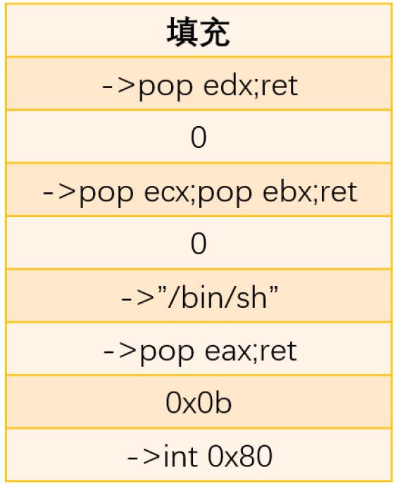
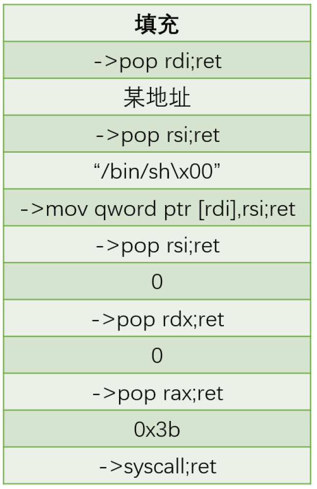

# ret2syscall

## 1.系统调用约定

* 32位程序： eax 对应系统调用号， ebx 、ecx 、edx 、esi 、edi 、ebp 分别对应前6个参数。`int 0x80`
* 64位程序： rax 对应系统调用号， rdi 、rsi 、rdx 、r10 、r8  、r9  分别对应前6个参数。`syscall`

## 2.32位

* eax = 0x0b=execute

* ebx = "/bin/sh"

* ecx = 0

* edx = 0

* 等价于execve("/bin/sh",NULL,NULL)函数

* `ROPgadget --binary pwn --only 'int'`

## 3.64位

* rax = 0x3b
* rdi = "/bin/sh"
* rsi = 0x0
* rdx = 0x0
* `ROPgadget --binary pwn | grep 'syscall'`
