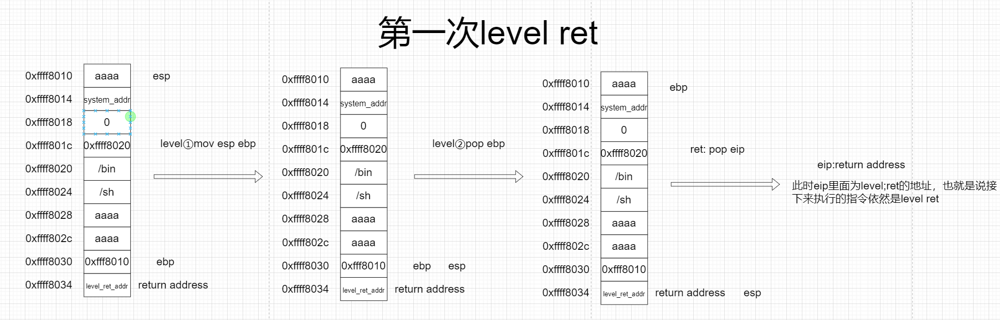
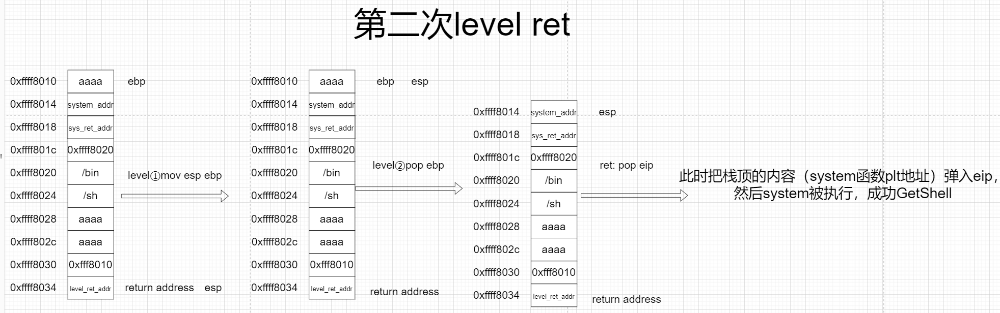

# 栈迁移

> 一般我们进行栈溢出攻击的时候，题目一般会给出足够大的空间写入我们的构造的ROP链，但是有一些题目会限制你的输入空间，比如我们只能只能覆盖到ebp,ret_addr这样的时候就是需要我们利用栈迁移将我们的栈转移到别的地方，一般是在bss段或栈中，我们可以在bss段或栈中设定一段gadget，之后将栈迁移从而getshell，这个时候就需要栈迁移

## 1.原理

栈迁移关键在于利用`leave;ret`指令

```
leave == mov esp ebp ; pop ebp (esp + 4/8)
ret == pop eip (esp +4/8)
```

首先获得要迁移的地址，然后利用溢出把EBP改掉，修改成要迁移的地址，然后返回地址改成leave；ret的地址，同时，迁移的地址处填写自己要利用的代码





## 2.栈迁移到数据填充段

