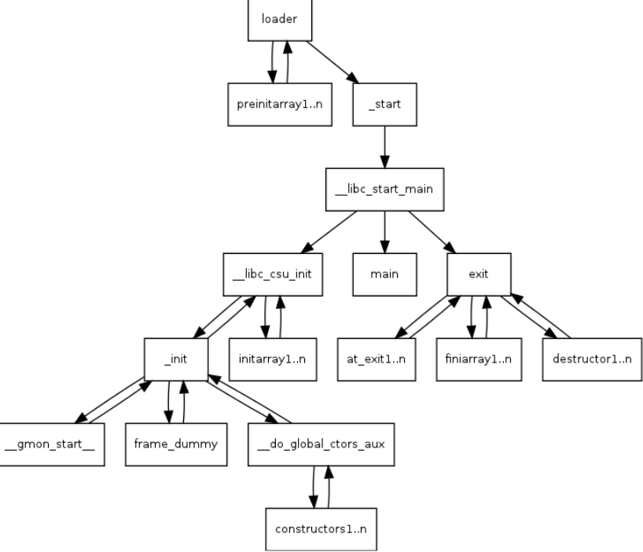

# ret2csu



## 1.程序执行流

- 首先程序调用 execve 生成一个进程，并且设置好数据
- 然后调用 `_start` 简单设置后就调用 `__libc_start_main`
- `__libc_start_main` 会先调用 `__libc_init_first` 获取环境变量 envp（作为 main 的第三个参数），然后越过 envp 数组之后的 `NULL` 字符，获取 ELF 辅助向量
- 把 `fini` 和 `rtld_fini` 作为参数传递给 `at_exit` 调用
- 调用其 `init` 参数，执行 `__libc_csu_init`
- 调用 `main` 函数，并把 `argc` 和 `argv` 参数、环境变量传递给它
- 调用 `exit` 函数，执行其中的 `__libc_csu_fini`


## 2.利用原理

在64位程序中，函数的前6个参数是通过寄存器传递的（rdi , rsi , rdx , rcx , r8 , r9），但是大多数时候，我们很难找到每一个寄存器对应的gadgets。这时候，我们可以利用x64下的__libc_csu_init中的gadgets

ret2csu是blackhat大会在2018年的一个议题，即通过__libc_csu_init 中的两个特殊 gadgets可实现万能传参

因为这个函数是用来对 libc 进行初始化操作的，而一般的程序都会调用 libc 函数，所以这个函数一定存在。同时利用完这段 gadget  之后可以控制函数的前三个参数（即 rdi rsi rdx）以及其他寄存器和调用函数地址，所以这个 gadget 也被称为 `通用 gadget`

```asm
text:0000000000400540                 public __libc_csu_init
.text:0000000000400540 __libc_csu_init proc near               ; DATA XREF: _start+16↑o
.text:0000000000400540 ; __unwind {
.text:0000000000400540                 push    r15
.text:0000000000400542                 push    r14
.text:0000000000400544                 mov     r15d, edi
.text:0000000000400547                 push    r13
.text:0000000000400549                 push    r12
.text:000000000040054B                 lea     r12, __frame_dummy_init_array_entry
.text:0000000000400552                 push    rbp
.text:0000000000400553                 lea     rbp, __do_global_dtors_aux_fini_array_entry
.text:000000000040055A                 push    rbx
.text:000000000040055B                 mov     r14, rsi
.text:000000000040055E                 mov     r13, rdx
.text:0000000000400561                 sub     rbp, r12
.text:0000000000400564                 sub     rsp, 8
.text:0000000000400568                 sar     rbp, 3 //算数右移
.text:000000000040056C                 call    _init_proc
.text:0000000000400571                 test    rbp, rbp
.text:0000000000400574                 jz      short loc_400596
.text:0000000000400576                 xor     ebx, ebx
.text:0000000000400578                 nop     dword ptr [rax+rax+00000000h]
.text:0000000000400580
.text:0000000000400580 loc_400580:   (gadget2)                 ; CODE XREF: __libc_csu_init+54↓j
.text:0000000000400580                 mov     rdx, r13
.text:0000000000400583                 mov     rsi, r14
.text:0000000000400586                 mov     edi, r15d
.text:0000000000400589                 call    qword ptr [r12+rbx*8]
.text:000000000040058D                 add     rbx, 1
.text:0000000000400591                 cmp     rbx, rbp
.text:0000000000400594                 jnz     short loc_400580
.text:0000000000400596
.text:0000000000400596 loc_400596:   (gadget1)                 ; CODE XREF: __libc_csu_init+34↑j
.text:0000000000400596                 add     rsp, 8
.text:000000000040059A                 pop     rbx //通常利用时设为0
.text:000000000040059B                 pop     rbp //通常利用时设为1
.text:000000000040059C                 pop     r12 //call addr
.text:000000000040059E                 pop     r13
.text:00000000004005A0                 pop     r14
.text:00000000004005A2                 pop     r15
.text:00000000004005A4                 retn
.text:00000000004005A4 ; } // starts at 400540
.text:00000000004005A4 __libc_csu_init endp
```

过程：

* 控制程序的执行流，把返回地址填写成gadget1的地址0x40059A（因为我们并不需要add rsp,8这个指令，因此直接从0x40059A开始即可），现在就会把栈中的前6个数据分别弹给rbx,rbp,r12,r13,r14,r15这6个寄存器 
* gadget1的结尾ret这里，然后我们紧接着写入gadget2的地址0x400580
* 继续向下执行，因此又来到了gadget1这里
* 如果不需要再一次控制参数的话，那我们此时把栈中的数据填充56（7*8）个垃圾数据即可。
* 如果我们还需要继续控制参数的话，那就此时不填充垃圾数据，继续去控制参数，总之不管干啥呢，这里都要凑齐56字节的数据，以便我们执行最后的ret，最后ret去执行我们想要执行的函数即可。

注意：

* rbx的值设置成0，这样的目的是在执行call qword ptr [r12+rbx*8]这个指令的时候，我们仅仅把r12的值给设置成指向我们想call地址的地址即可，从而不用管rbx

* rbx为0，此时call  r12，可以装got地址，也可以装一个地址（这个地址是被另一个地址所指向的），然后把r12填写成另一个地址，也可以call成功，原因也是出现在了got地址仅仅会跳转一次，也就是说填一个got地址，也是会从这个地址去跳到got地址所指向的地址（也就是真实地址)，因此结论就是要想去call去跳转到一个地址A，那就必须用一个指向地址A的地址B放到call后面

* 如果仅仅是想利用ret2csu去控制参数，而并不想去用call执行，或者说是你想用call执行跳转，但是你找不到去指向你想跳转的那个地址，因此我们用最后的ret跳转（你想跳转到哪里，就填哪的地址即可）。我们可以call一个空函数（不需要参数，执行之后也不会对程序本身造成任何影响的函数），这个函数就是`_term_proc`

  ```asm
  .fini:00000000004008B4                 public _term_proc
  .fini:00000000004008B4 _term_proc      proc near
  .fini:00000000004008B4                 sub     rsp, 8          ; _fini
  .fini:00000000004008B8                 add     rsp, 8
  .fini:00000000004008BC                 retn
  .fini:00000000004008BC _term_proc      endp
  ```

* rbp设置成1，因为这三个指令add rbx,1；cmp rbx,rbp；jnz short loc_400580，我们通常并不想跳转到0x400580这个地方，因为此刻执行这三个指令的时候，我们就是从0x400580这个地址过来的。因此rbx加一之后，我们要让它和rbp相等，因此rbp就要提前被设置成1

* r13,r14,r15这三个值分别对应了rdx,rsi,edi。这里要注意的是，r15最后传给的是edi,最后rdi的高四字节都是00，而低四字节才是r15里的内容。（也就是说如果想用ret2csu去把rdi里存放成一个地址是不可行的）
