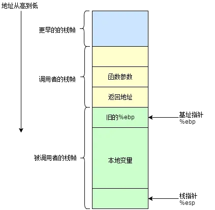

C语言中，每个栈帧对应着一个未运行完的函数。栈帧中保存了该函数的返回地址和局部变量。从这句话中，可以提炼以下几点信息

栈帧是一块因函数运行而临时开辟的空间。

每调用一次函数便会创建一个独立栈帧。

栈帧中存放的是函数中的必要信息，如局部变量、函数传参、返回值等。

当函数运行完毕栈帧将会销毁

栈帧示意图：

函数调用

函数调用分为以下几步:

参数入栈: 将参数按照调用约定(C 是从右向左)依次压入系统栈中;
返回地址入栈: 将当前代码区调用指令的下一条指令地址压入栈中，供函数返回时继续执行;
代码跳转: 处理器将代码区跳转到被调用函数的入口处;
栈帧调整:  
1.将调用者的ebp压栈处理，保存指向栈底的ebp的地址（方便函数返回之后的现场恢复），此时esp指向新的栈顶位置； push ebp  
2.将当前栈帧切换到新栈帧(将eps值装入ebp，更新栈帧底部), 这时ebp指向栈顶，而此时栈顶就是old ebp mov ebp, esp  
3.给新栈帧分配空间 sub esp, XXX 

函数返回

函数返回分为以下几步:

    保存被调用函数的返回值到 eax 寄存器中 mov eax, xxx
    恢复 esp 同时回收局部变量空间 mov ebp, esp
    将上一个栈帧底部位置恢复到 ebp pop ebp
    弹出当前栈顶元素,从栈中取到返回地址,并跳转到该位置 ret