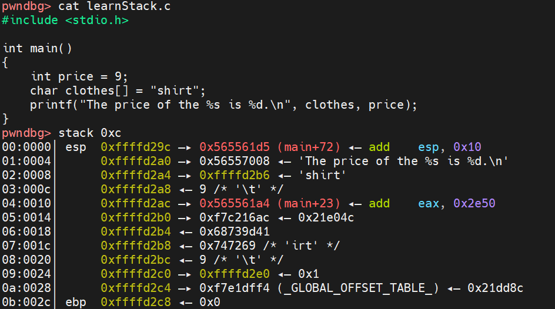
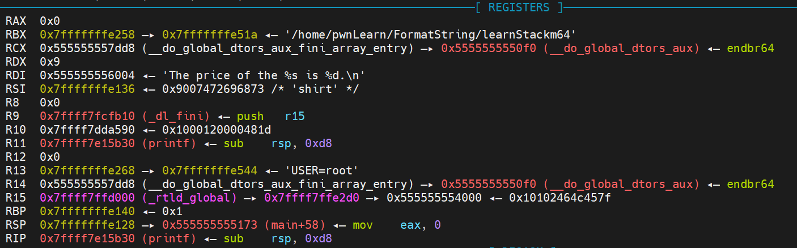

# 格式化字符串漏洞利用

> 32位程序通过栈传参而64位程序传参的顺序为rdi, rsi, rdx, rcx, r8, r9，接下来才是栈


## 1.程序崩溃

```
%s%s%s%s%s%s%s%s%s%s%s%s%s%s
```

利用格式化字符串漏洞使得程序崩溃是最为简单的利用方式，因为我们只需要输入若干个 %s 即可，因为栈上不可能每个值都对应了合法的地址，所以总是会有某个地址可以使得程序崩溃


## 2.泄露内存

### 2.1 泄露栈内存

#### 2.1.1 获取栈变量数值

* 示例代码：

```
char content[0x20];
read(0, content, 0x20);
printf(content);
```

* 输入：%p%p

* 输出：0xffffd02c0x20

* 产生原因：**`printf`仍然把我们传入的数据当作字符串，并将栈上后面的数据以字符串中`%`开头的方式进行解析**。输入的数据为`%p%p`时，它将会把栈上后面的数据当作传入函数的参数，并以`%p`的方式解析。例如，`printf`将栈上的`0xffffd014`处内容进行解析，并以十六进制格式输出存放在该栈处的值`0xffffd02c`，接下来再以同样的方式将`0xffffd018`处的值以`%p`的方式进行解析，输出`0x20`

```
stack
00:0000│ esp     0xffffd010 —▸ 0xffffd02c ◂— 0x70243225 ('%2$p')  // 这是第0个参数
01:0004│         0xffffd014 —▸ 0xffffd02c ◂— 0x70243225 ('%2$p')  // 这是第1个参数
02:0008│         0xffffd018 ◂— 0x20 /* ' ' */                     // 这是第2个参数
03:000c│         0xffffd01c —▸ 0x56556228 (main+27) ◂— add ebx, 0x2da8        // 这是第3个参数
04:0010│         0xffffd020 —▸ 0xf7fb0000 (_GLOBAL_OFFSET_TABLE_) ◂— 0x1e9d6c // 这是第4个参数
05:0014│         0xffffd024 —▸ 0xf7fe22f0 ◂— endbr32                          // 这是第5个参数
06:0018│         0xffffd028 ◂— 0x0                                            // 这是第6个参数
07:001c│ eax ecx 0xffffd02c ◂— 0x70243225 ('%2$p')    
```

* **进阶**：使用`%n$p`的方式来泄露栈上指定位置的内容的解析值。其中，`n`是要泄露的第几个位置。也可以`%n$x`,直接泄露栈上内容而不解析


#### 2.1.2 获取栈变量对应字符串

使用%s即可，对应用法同上，但是，如果**对应的变量不能够被解析为字符串地址，那么，程序就会直接崩溃。**


### 2.2 泄露任意地址内存

- 利用 GOT 表得到 libc 函数地址，进而获取 libc，进而获取其它 libc 函数地址
- 盲打，dump 整个程序，获取有用信息


## 3.覆盖内存
