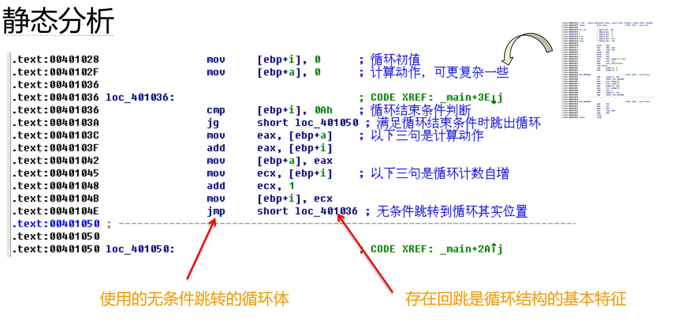

# 逆向基本


> 函数原型:参数个数及类型、返回值
>
> 函数序言和尾声：开辟和释放栈帧

## 1.函数调用约定

C++程序：

* x86架构：cdecl，stdcall，fastcall，thiscall
* x86-64架构：变形fastcall，thiscall

### 1.1 __cdecl

* C调用约定
* UNIX系统中常用的钟函数调用约定
* 传参：逆序传参
* 栈平衡，**调用者**清理

### 1.2 __stdcall

* 标准调用约定
* Windows API使用stdcall
* 传参：逆序传参
* 栈平衡，**被调用者**清理

### 1.3 __fastcall

* 快速调用约定
* windows中的一种高效调用
* 传参：前两个参数eax，edx传，后面stdcall
* 参数个数小于等于2个时不存在栈平衡的问题

### 1.4 __thiscall

* 用于 x86 体系结构上的 C++ 类成员函数
* 栈平衡，被调用者清理


## 2.基本数据类型

> 二进制代码中只有内存大小，没有类型信息

* 全局变量位于全局数据区，已被初始化：初始化全局变量的常量已被赋值到全局数据区，没有产生代码

* 局部变量:
  * 位于栈中，使用[ebp-x]的格式对其引用
  * 产生汇编代码实现初始化赋值
  * 先声明的变量位于栈底，高地址
  * 后声明的变量位于栈顶，低地址
  * 数字常量作为指令的立即数，位于代码段
  * 字符串常量位于全局静态区

* 指针：int *，double *，char *


## 3.基本操作类型

* 加，减，乘，除（cdq指令，有符号数的扩展）

  | 被除数  | 除数      | 商   | 余数 |
  | ------- | --------- | ---- | ---- |
  | AX      | reg/mem8  | AL   | AH   |
  | DX:AX   | reg/mem16 | AX   | DX   |
  | EDX:EAX | reg/mem32 | EAX  | EDX  |

* 逻辑运算
* 浮点指令


## 4.基本控制结构

* 顺序结构

* 分支结构：
  * if/else
  
  * switch
  
    * case分支小于4个时，其反汇编与if...else类似
    * 当case分支大于等于4个且连续时，会在一段连续内存中存储每个case所对应语句块的起始地址（称其为大表或跳转表），根据[edx*4+xxxxxxh]即可确定跳转地址
      * case条件连续时，使用单跳转表
      * case条件不连续时，使用二级跳转表技术
    
    
    
    
  * break，continue：被编译成无条件跳转
  
* 循环结构:

  * while循环：流程图含2个基本块
  
    ```c
    #include <stdio.h>
    #include <stdlib.h>
    void main()
    {
        int i=0,a =0;
        while (i<=10)
        {
        	a+=i;
        	i++
    	}
    	return 0;
    }
    ```
  
    
  
    
  * do/while循环：流程图含1个基本块
  * for循环：流程图含3个基本块

