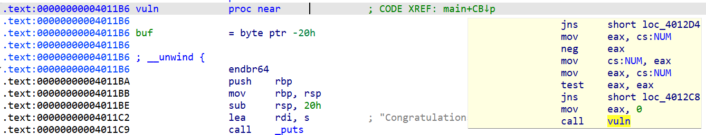

# 交叉引用

> xref

## 1.介绍

两种基本的交叉引用：

* 代码交叉引用
* 数据交叉引用

范例：

* CODE XREF：代码交叉引用
* main+CB：交叉引用的源地址
* ↓p：引用位置的相对方向

## 2.代码交叉引用

代码交叉引用用于一条指令将控制权转交给另一条指令，在IDA里也称之为流（flow），同时又分为三种基本的流：

* 普通流：是一种最简单的流，表示从一条指令到另一条指令的顺序流，这是默认的执行流，没有特殊的显示标志
* 跳转流：每个无条件分支指令和条件分支指令，后缀`j` (jump)
* 调用流：call指令,由函数调用导致的交叉引用用后缀`p` (procedure)

## 3.数据交叉引用

数据交叉引用用于跟踪二进制文件访问数据的方式

* 读取交叉引用：访问的是某个内存位置的内容，后缀`r`
* 写入交叉引用：指出了修改变量内容的位置，后缀`w`
* 偏移量交叉引用：引用某个位置的地址，后缀`o`