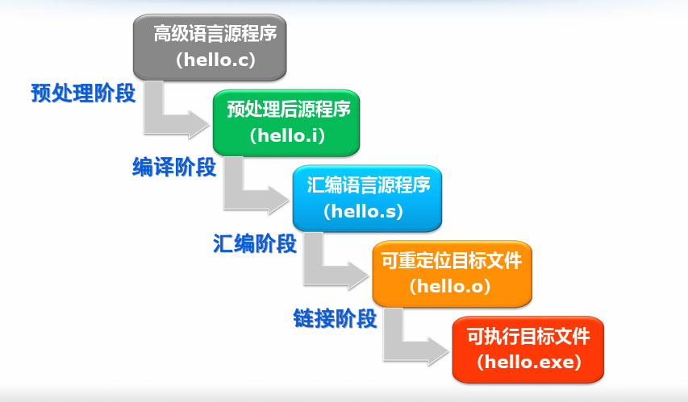

# gcc与g++


## 1.程序处理流程



- **预处理**： 编译器处理预处理命令，包括头文件包含、宏定义的扩展、条件编译的选择等；
- **编译**：将预处理后的源代码文件 *翻译转换* 得到机器语言的目标程序，得到机器语言汇编文件；
- **汇编**：将汇编代码翻译成机器码，此时的机器码尚不能直接运行；
- **链接**：处理可重定位文件，把各种符号引用和符号定义转换成为可执行文件中的合适信息，通常是虚拟地址。


## 2.常用命令

```shell
gcc [options] [filenames]
gcc -E hello.c -o hello.i
gcc -S hello.i -o hello.s
gcc -c hello.s -o hello.o
gcc hello.o-o hello.exe
```

- -E：对文件作预处理
- -S：对文件进行编译
- -c：对文件进行汇编
- -o：指定输出文件名
