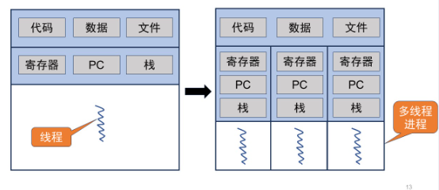

# 并发、线程api


## 1.并发基本概念



* 多个计算任务在同一个时间段内发生（交替执行）
* 线程（thread）：进程的最小执行单元（OS调度的基本单元）
* 同一进程不同线程共享同一地址空间（全局变量共享）
* 临界段：访问共享变量（临界资源）的程序段，访问相同临界区的代码应该互斥执行（数据竞争：多线程同时进入临界区）
* 利用锁lock来保证临界区的原子性


## 2.线程api

```c
int pthread_create(pthread_t *thread,
                   const pthread_attr_t *attr,
                   void *(*start_routine) (void *),
                   void *arg);
```

* 创建线程
* 参数：
  * thread：线程结构体指针
  * attr：属性，如调度优先级，栈大小
  * start_routine：线程运行的主函数
  * arg：主函数要用到的参数

```c
int pthread_join(pthread_t thread, void ** retval);
```

* 等待进程结束
* 参数：
  * thread：线程结构体对象
  * retval：返回值指针