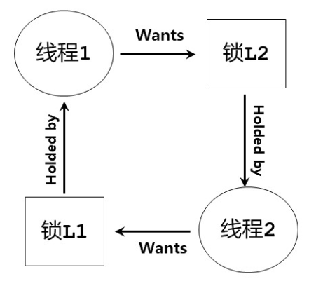

# 常见的并发问题

## 1.非死锁缺陷

### 1.1 违反原子性缺陷

访问临界区，未加锁，通过加锁解决

### 1.2 违反顺序缺陷

通过加条件变量保证执行顺序

## 2.死锁

* 概念：在一个进程集合中，每个进程都在等待另外的进程释放资源（资源也可以是锁），而这些释放事件又必须由这个进程集合中的进程运行来产生，就称该进程集合处于死锁状态
* 死锁的四个必要条件：
  * 互斥占用：存在必须互斥使用的资源
  * 持有并等待：存在占有资源而又等待其他资源的进程
  * 非抢占：进程占有的资源未释放时不可以被抢占
  * 循环等待：存在一个资源等待的依赖环
* 死锁的预防和避免：（破坏死锁的四个必要条件之一即可）
  * 

