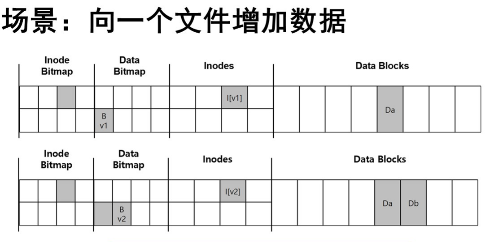
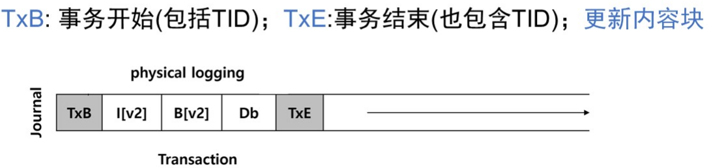

# 崩溃一致性

## 1.案例场景

发生故障：只有下列一个块写入了磁盘：

* 数据块(Db)：写入好像并未发生（从一致性角度危害性不大）
* inode(l[v2])：从磁盘读取垃圾数据（旧的数据）
* 位图(B[2])：空间泄露(space leak)

有两个块写入了磁盘，剩下的一个丢失：

* inode和位图：元数据一致，但存储的是垃圾数据
* inode和数据块：inode和位图存在不一致，之后的写入需要解决
* 位图和数据块：inode和位图存在不一致，不知道块属于哪个文件

背景：数据存储在磁盘上，磁盘的IO操作不是原子的

原因：I/O过程中可能出现崩溃

可能后果：

* 数据丢失
* 部分数据写入，导致各数据块不一致
* 文件元数据不一致

## 2.解决方案1：FSCK

文件系统检查程序，一款unix工具，用来检查不一致性并且进行修复

目标是一致性问题，无法检查垃圾数据的问题

最大的问题：性能太差：

* 总是需要扫描整个磁盘（几分钟甚至几小时）
* 可以用作磁盘的定期性检查

## 3.解决方案2：预写日志

核心思路：在真正更新磁盘之前，先在一个地方写下一点注记（日志），描述将要做的事情

数据日志格式

增加Checkpoint:当这个事务被存在磁盘上后，则会将具体更新的内容块写到磁盘上

## 4.解决方案3：元数据日志

磁盘上存储日志的空间是有限的：

* 重复使用这些空间：循环日志(circular log
* 在日志超级块中记录最旧和最新的事务
* 增加释放的过程：当日志被加检查点后

数据预写日志基本需要使写入流量翻倍，故在日志中只记录元数据，而数据在元数据日志写到磁盘前写入磁盘，减少一次数据的写入

* 数据写入：将数据写到磁盘最终位置
* 日志元数据写入：将元数据写入日志
* 日志提交：将TxE写入日志，等待完成
* 加检查点元数据：将日志内容写到磁盘
* 释放：将superblock对应的部分释放

## 5.日志结构文件系统

