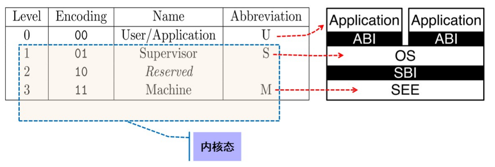
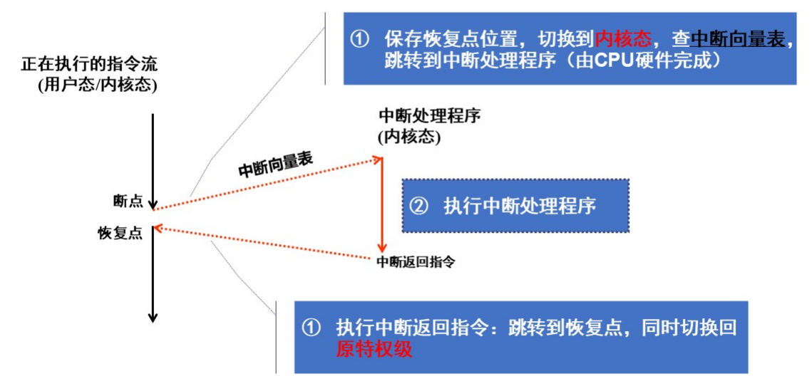
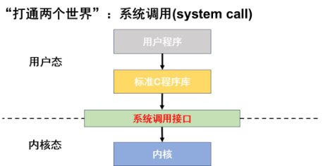
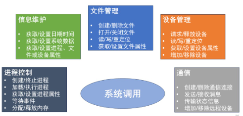
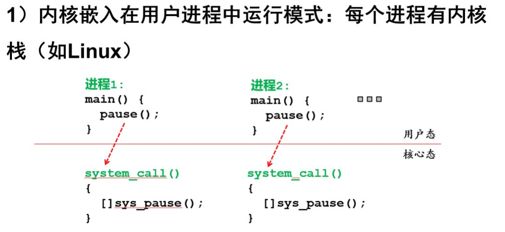
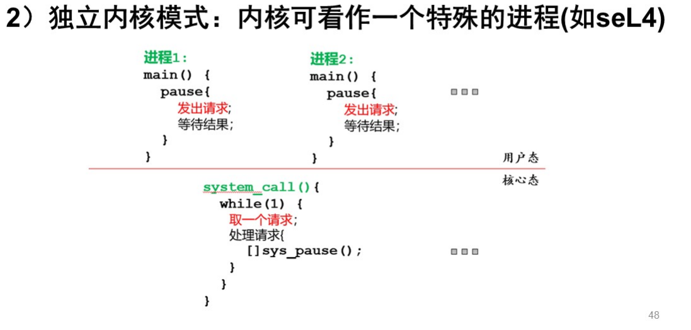
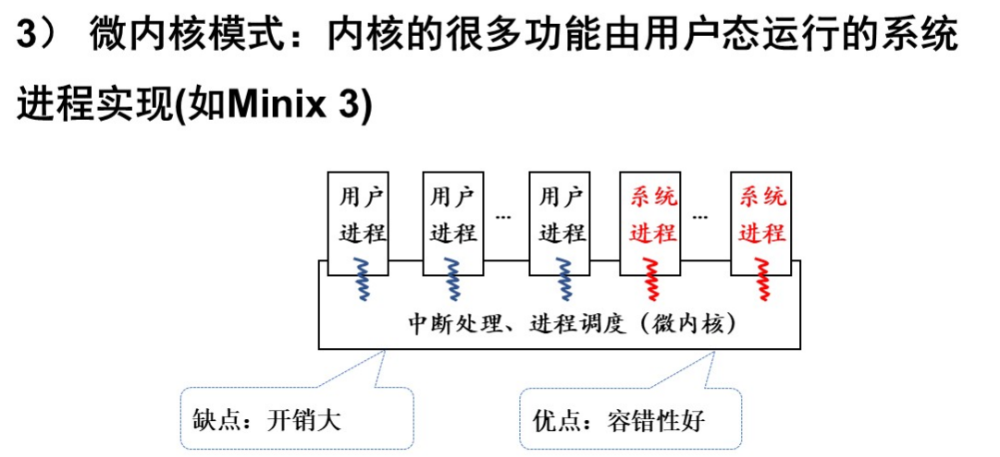

# 受限直接执行

## 1.基本概念

受保护的控制权转移：

- 用户模式(用户态):应用程序不能访问所有硬件资源
- 内核模式(内核态):0S可以访问机器的所有资源

RISC-V特权级：

- ABI:程序二进制接口
- SB1:内核与硬件接口
- SEE:安全执行环境

## 2.中断和异常

中断和异常是事件，当OS启动后，所有对内核的访问都是由于事件导致的，事件发生后，转换为内核态，并且调用处理程序（控制程序保存程序状态、执行内核功能、恢复程序状态，继续执行）

中断向量表:一片存放中断处理程序入口地址的内存单元，中断向量在内存中连续存放，起始地址一般记录在某特定寄存器，硬件按中断号的不同通过中断向量表跳转到相应处理程序中

## 3.系统调用

系统调用的实现：使用陷阱（trap）指令 

## 4.操作系统运行模式

进入内核只有态的切换没有进程的切换

优点：便于保证内核的正确性

缺点：内核的并发运行困难

