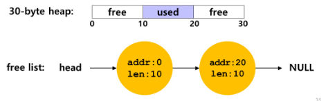
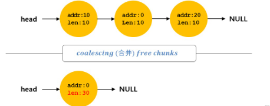
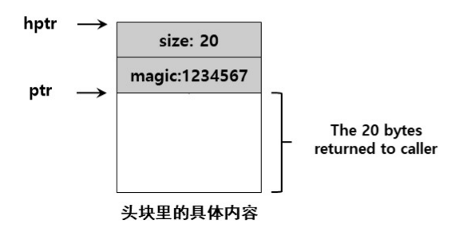

# 分段、空闲空间管理

## 1.分段地址转换

* 段是虚拟地址空间中的一个连续的片段(代码段，栈段，堆段)
* 对于每个段来说，都有它的基址和界限
* 物理地址 = 段基址 + 段内偏移
* 非法内存访问，超出了界限，就会报段错误（segmentation fault），陷入内核态
* 段的标识：
  * 显示：用虚拟地址的高位表示
  * 隐式：不放在CPU地址中，放在段寄存器，寄存器预留一位记录增长方向
* 段的共享与保护：为了节省内存，例如代码共享。需要硬件提供支持，段的保护位
* OS需要处理的事项：
  * 上下文切换时，所有的段寄存器都要保护和恢复
  * 需要应对碎片化问题
  * 紧致化处理：停止进程运行，拷贝数据，修改段寄存器的值


## 2.空闲空间管理

### 2.1 底层机制

分隔与合并：





使用free(void *ptr)释放已申请的内存空间时，会发现该接口没有块大小的参数。因此它假定对于给定的指针，内存分配库可以很快确定要释放空间的大小，从而将它放回空闲列表。要完成这个任务，大多数分配程序都会在头块（存在于返回的内存块之前）中保存一些额外的信息。在下面这个例子中，我们调用int *ptr = malloc(20)申请20字节的空间，并将结果保存在ptr中



```c
void free(void *ptr) { 
 header_t *hptr = (void *)ptr - sizeof(header_t); 
}
```

```c
typedef struct header_t {
    int size;
    int magic; //用来检查完整性
} header_t;
```


### 2.2 空闲内存分配策略

