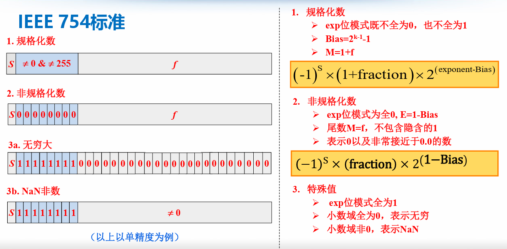

# 浮点数的表示

> 二进制小数的表示是具有局限性的，无法精确表示出所有的小数

## 1.IEEE浮点数表示（IEEE754标准）

### 1.1 实数的二进制规格化表示

符号s

尾数fraction

基数

阶码Exp
$$
(-1)^S \times (1+frac) \times 2^{Exp-Bias}
$$

* Exp位模式既不全为0，也不全为1
* $Bias=2^{k-1}-1$ , k为Exp的位数

### 1.2 非规格化数

$$
(-1)^S \times (frac) \times 2^{1-Bias}
$$

* Exp位模式全为0
* 表示0以及非常接近于0.0的数

### 1.3 特殊值

* Exp位模式全为1
* 小数域全为0，表示无穷大，小数域非0，表示NaN

## 2.浮点数的舍入

## 3.浮点数的运算

