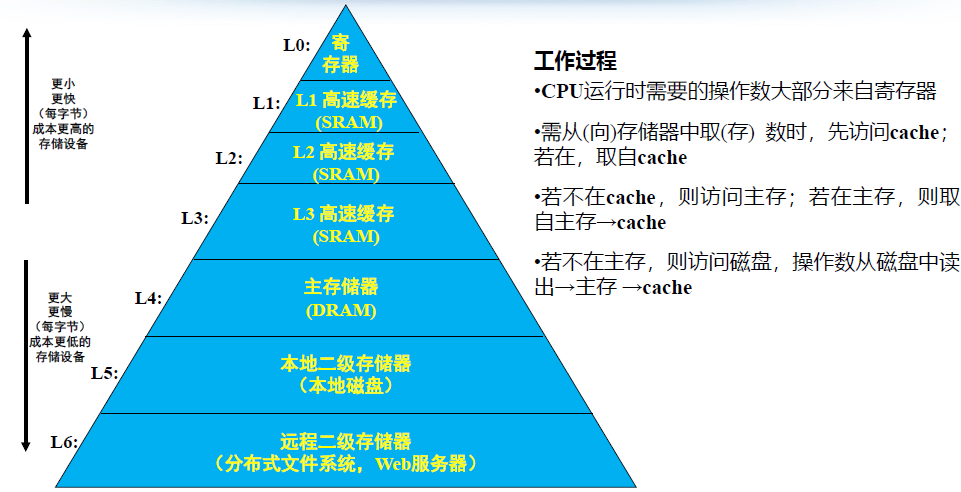
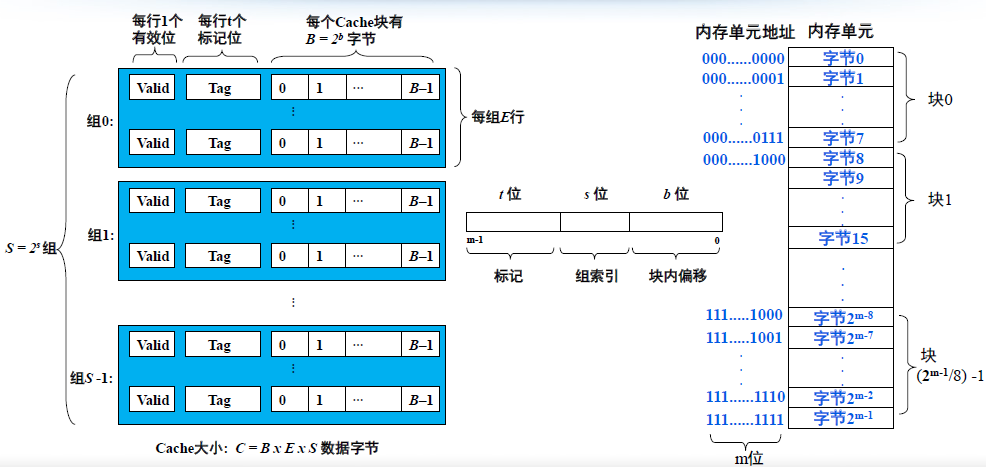
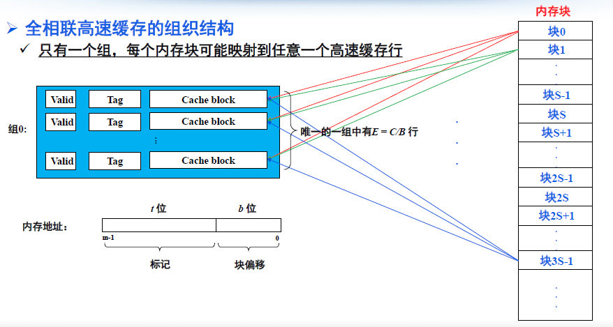

# 高速缓存

## 1.局部性原理

程序访问局部性分类：

* 时间局部性：刚被访问过的存储单元不久又被访问
* 空间局部性：刚被访问过的存储单元不久临近单元也被访问

## 2.存储层次结构

## 3.高速缓存

### 3.1 通用高速缓存存储器组织架构

### 3.2 三种映射关系

> 直接映射：唯一映射(只有一个可能的位置)
> 全相联映射：任意映射(每个位置都可能)
> N-路组相联映射：N-路映射(有N个可能的位置)

#### 3.2.2 全相联高速缓存

