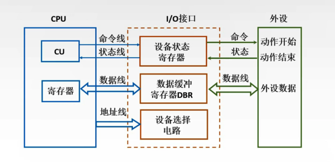
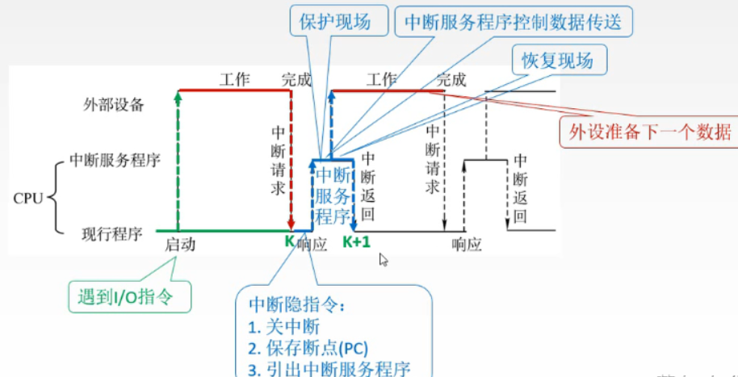
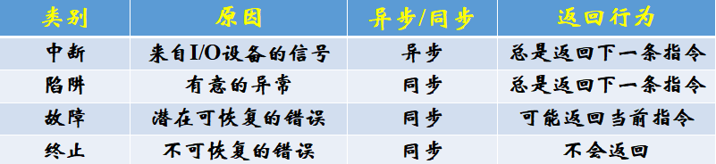
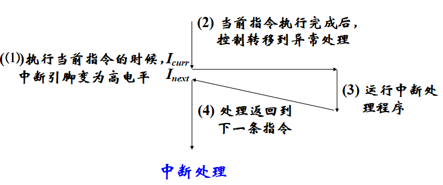
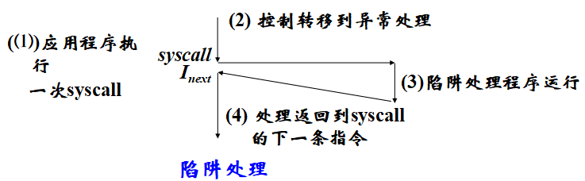
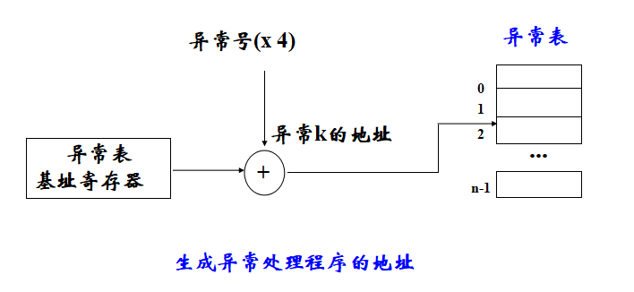
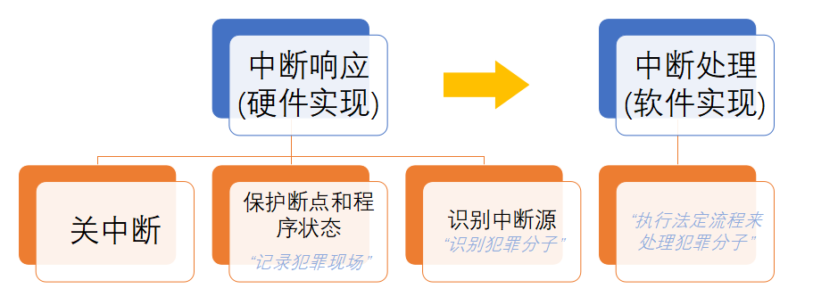

# IO控制方式

## 1.IO Polling（程序轮询方式）

* 概述：CPU定时对各种设备主动轮流询问一遍有无处理要求（I/O设备(包括I/O接口)将自己的状态放到一个状态寄存器中）。轮流询问之后，有要求的，则加以处理。在处理I/O设备的要求之后，CPU返回继续工作
* 特点：
  * 软件只需要一条IO指令
  * 硬件简单只需要一个数据缓冲寄存器
  * 对CPU打扰大，效率低，很少使用

## 2.IO Interrupt（中断控制方式）

* 概述：外设准备好时，便向CPU发中断请求，CPU响应后，中止现行程序的执行，转入一个“中断服务程序”进行输入/出操作，实现主机和外设接口之间的数据传送，并启动外设工作。 “中断服务程序”执行完后，返回原被中止的程序断点处继续执行。此时，外设和CPU并行工作

### 2.1 异常

* 基本概念：
  * RISC-V下，中断时一种特殊的异常，而异常是控制流中的突变，一般由“事件”引起，用来响应处理器状态中的某些变化
  * 异常由硬件和OS协同实现
  * 处理器通过“异常表(exception table)”进行跳转，OS专门设计用来处理这类事件的“异常处理程序(exception handler)”
* 常见的异常：虚拟内存缺页、算术运算溢出、除以零、外部定时器产生中断
* 异常处理：CPU检测到异常后，会通过异常表，进行一个间接过程调用，到一个专门的异常处理程序
* 异常处理完成后，可能有三种结束方式：
  * 返回到Icurr(即重新执行引起异常的指令)
  * 返回到Inext
  * 终止被中断的程序执行

### 2.2 异常的分类

* 同步异常：执行一条指令的直接产物

* 异步异常：由处理器外部的I/O设备中的事件产生

#### 2.2.1 中断

> 来自外部IO的异步信号

#### 2.2.2 陷阱

> 执行指令的“有意”的结果，用户态陷入内核，特权切换

背景：计算机有两种运行模式：用户态， 内核态。 其中操作系统运行在内核态，在内核态中，操作系统具有对所有硬件的完全访问权限，可以使机器运行任何指令；相反，用户程序运行在用户态，在用户态下，软件只能使用少数指令，它们并不具备直接访问硬件的权限

#### 2.2.3 故障

> 由错误情况引起，可能被修正：
>
> * 能修正：返回到引起故障的指令，重新执行该指令
> * 不能修正：返回到内核的abort例程，终止引起故障的应用程序继续执行

典型：缺页异常（指令引用一个虚拟地址，但该虚拟页不在内存，则产生缺页故障）

#### 2.2.4 中止

> 不可恢复的致命错误结果，终止处理程序从不会把控制权返回给应用程序

### 2.3 异常的处理

> 首先：关中断！即：中断允许标志清0

* **保护断点和程序状态** :

  * **将返回原程序执行的断点和程序状态保存到堆栈或特殊寄存器中**     
  * PC=>堆栈 或 EPC；PSWR=>堆栈 或 EPSWR(注：PSW(Program Status Word)：程序状态字 ,PSWR(PSW寄存器)：用于存放程序状态的寄存器。如，X86的Flag

* 识别异常事件：

  * 软件识别(RISC-V采用) ：设置异常状态寄存器(RISC-V中为Cause寄存器)，用于记录异常原因。操作系统采用统一的异常处理程序(RISC-V的入口为0x1C00 0900) ，按该程序中的优先级顺序查询并识别出异常事件
  * 硬件识别(向量中断)(80x86采用)：用专门的硬件查询电路按优先级顺序识别异常，并得到一个“中断类型号”，据此进入中断向量表读取对应的中断服务程序的入口地址

* **切换到具体的异常处理程序执行**：

  * 确定异常号（异常表的索引，异常表是一个跳转表，每条表目包含异常的处理程序代码的地址）（异常基址寄存器：CPU中的一个特殊寄存器，用来存放异常表在内存的起始地址）

    

  * 触发异常，执行间接过程调用

### 2.3 中断的处理

## 3.Direct Memory Access（DMA方式）

>  直接存储器存取